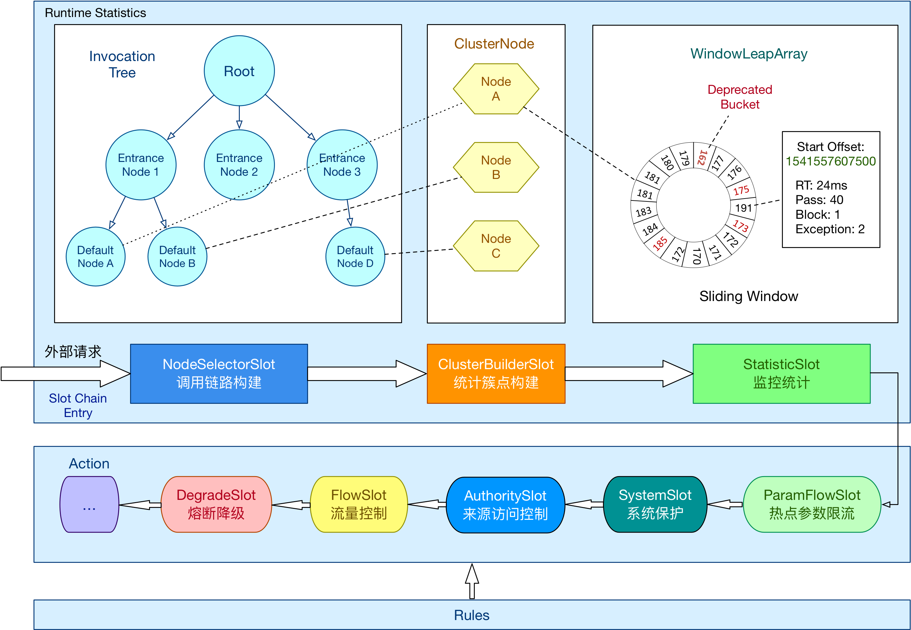

# Sentinel: 分布式系统的流量防卫兵

[官方文档](https://github.com/alibaba/Sentinel/wiki/%E4%BB%8B%E7%BB%8D)

[Awesome Sentinel](./awesome-sentinel.md)

## Sentinel 原理流程图


---

## Sentinel 是什么？

Sentinel 是分布式系统的防御系统。以流量为切入点，通过动态设置的流量控制、服务熔断降级、系统负载保护等多个维度保护服务的稳定性，通过服务降级增强服务被拒后用户的体验。


### Sentinel 具有以下特征:

- **丰富的应用场景**：Sentinel 承接了阿里巴巴近 10 年的双十一大促流量的核心场景，例如秒杀（即突发流量控制在系统容量可以承受的范围）、消息削峰填谷、集群流量控制、实时熔断下游不可用应用等。
- **完备的实时监控**：Sentinel 同时提供实时的监控功能。您可以在控制台中看到接入应用的单台机器秒级数据，甚至 500 台以下规模的集群的汇总运行情况。
- **广泛的开源生态**：Sentinel 提供开箱即用的与其它开源框架/库的整合模块，例如与 Spring Cloud、Apache Dubbo、gRPC、Quarkus 的整合。您只需要引入相应的依赖并进行简单的配置即可快速地接入 Sentinel。同时 Sentinel 提供 Java/Go/C++ 等多语言的原生实现。
- **完善的 SPI 扩展机制**：Sentinel 提供简单易用、完善的 SPI 扩展接口。您可以通过实现扩展接口来快速地定制逻辑。例如定制规则管理、适配动态数据源等。


### Sentinel 的主要特性：


### Sentinel 分为两个部分:

- 核心库（Java 客户端）不依赖任何框架/库，能够运行于所有 Java 运行时环境，同时对 Dubbo/Spring Cloud 等框架也有较好的支持。
- 控制台（Dashboard）基于 Spring Boot 开发，打包后可以直接运行，不需要额外的 Tomcat 等应用容器。

---

## Sentinel 基本概念

Sentinel 实现限流、隔离、降级、熔断功能，本质要做的就是两件事：

- 统计数据：统计某个资源的访问数据，例如：QPS、RT 等信息；
- 规则判断：判断限流规则、隔离规则、降级规则、熔断规则是否满足。


### 资源

- 资源是 Sentinel 的关键概念。它可以是 Java 应用程序中的任何内容，例如，由应用程序提供的服务，或由应用程序调用的其它应用提供的服务，甚至可以是一段代码。

- 只要通过 Sentinel API 定义的代码，就是资源，能够被 Sentinel 保护起来。大部分情况下，可以使用方法签名，URL，甚至服务名称作为资源名来表示资源。

- **资源就是希望被 Sentinel 保护的业务，例如项目中定义的 Controller 方法，就是默认被 Sentinel 保护的资源**


### 规则

围绕资源的实时状态设定的规则，可以包括**流量控制规则**、**熔断降级规则**以及**系统保护规则**。所有规则可以动态实时调整。

---

## Sentinel 的基本使用

### 熔断与限流

1. #### 定义资源

    > 资源：可以是任何东西，如引用程序提供的服务、RPC 接口方法、甚至是一段代码。只要通过 Sentinel API 定义的代码，就是资源，就能够被 Sentinel 保护起来。
    >
    > 大部分情况下，可以使用方法签名、URL、甚至服务名称作为资源名来标识资源。
    >
    > 资源注解 @SentinelResource，用于定义资源，并提供可选的异常处理和 fallback 配置项。@SentinelResource 注解包含以下属性：
    >
    > - value：资源名称（不能为空）
    > - entryType：entry 类型，可选项（默认为 `EntryType.OUT`）
    > - blockHandler/blocakHandlerClass：blockHandler 对应处理 BlockException 的函数名称，可选项。blockHandler 函数访问范围需要是 public，返回值类型需要与原方法相匹配，参数类型需要和原方法向匹配并且最后加一个额外的参数，类型为 BlockException。blockHandler 函数默认需要和原方法在用一个类中，若希望使用其它类的函数，则可以指定 blockHandlerClass 为对应的类的 Class 对象，注意对应的函数必须为 static 函数，否则无法解析。
    > - fallback/fallbackClass：fallback 函数名称，可选项，用于在抛出异常的时候提供 fallback 处理逻辑。fallback 函数可以针对所有类型的异常（除了 exceptionToIgnore 里面排除掉的异常类型）进行处理。
    > - defaultFallback：(1.6.0 版本) 默认的 fallback 函数名称，可选项，通常用于通用的 fallback 逻辑，即可以用于很多服务或方法。默认 fallback 函数可以针对所有类型的异常（除了 exceptionToIgnore 里面排除掉的异常类型）进行处理，若同时配置了 fallback 和 defaultFallback，则只有 fallback 会生效。
    >
    > fallback/defaultFallback 函数签名和位置要求：
    >
    > - 返回值类型必须与原函数返回值类型一致；
    > - 方法参数列表需要和原函数一致，或者可以额外多一个 Throwable 类型的参数，用于接收对应的异常；
    > - fallback/defaultFallback 函数默认需要和原方法在同一个类中，若希望使用其它类的函数，则可以指定 fallbackClass 为对应的类的 Class 对象，注意对应的函数必须为 static 函数，否则无法解析；
    > - exceptionToIgnore（since 1.6.0）：用于指定哪些异常被排除掉，不会计入异常统计中，也不会进入 fallback 逻辑中，而是会原样抛出。

2. #### 定义规则

    > 规则：Sentinel 支持使用以下几种规则：
    >
    > - 流量控制规则：`FlowRuleManager.loadRules(List<FlowRule> rules)`
    > - 熔断降级规则：`DegradeRuleManager.loadRules(List<DegradeRule> rules)`
    > - 系统保护规则：`SystemRuleManager.loadRules(List<SystemRule> rules)`
    > - 来源访问控制规则：`AuthorityRuleManager.loadRules(List<AuthorityRule> rules)`
    > - 热点参数规则：`ParamFlowRuleManager.loadRules(List<ParamFlowRule> rules)`

3. #### 检验规则是否生效

    > Sentinel 的所有规则都可以在内存中动态的查询及修改，修改后立即生效。先把可能需要保护的资源定义好，之后再匹配规则。
    >
    > 只要有了资源，就可以在任何时候，灵活地定义各种流量控制规则，在编码的时候，只需要考虑这个代码是否需要被保护，如果需要被保护，就将之称为一个资源。


### 流控规则

#### 系统保护规则 SystemRule：

- 系统保护规则是从应用级别的入口流量进行控制，从单台机器的总体 Load、RT、入口 QPS 和线程数，这四个维度监控应用数据，让系统尽可能跑在最大的吞吐量的同时保证系统整体的稳定性
- 系统保护规则是应用整体维度的，而不是资源维度的，并且仅对入口流量生效。入口流量指的是进入应用的流量（`EntryType.IN`），比如 Web 服务或 Dubbo 服务端接收的请求，都属于入口流量。


系统保护的目的：

- 保证系统不被拖垮
- 在系统稳定的前提下，保持系统的吞吐量


提供保护的思路是根据硬指标，即系统的负载（load1）来做系统过载保护。当系统负载高于某个阈值，就禁止或减少流量的进入；当 load 开始好转，则恢复流量的进入。

系统保护的目标是在系统不被拖垮的情况下，提高系统的吞吐率，而不是 load 一定要定于某个阈值。


系统保护规则支持四种阈值类型：

- Load（仅对 Linux/Unix-like 机器生效）：当系统 load1 超出阈值，且系统当前的并发线程数超过系统容量时才会触发系统保护。系统容量由系统的 `maxQps * minRT `计算得出，设定参考值一般是 CPU 核心数的 2.5 倍；
- CPU 使用率：当系统 CPU 使用率超过阈值即触发系统保护（取值范围 0.0~1.0），比较灵敏；
- 平均 RT：当单台机器上所有入口流量的平均 RT 达到阈值时，即触发系统保护，单位是毫秒；
- 并发线程数：当单台机器上所有入口流量的并发线程数达到阈值时触发系统保护
- 入口 QPS：当单台机器上所有入口流量的QPS 达到阈值时触发系统保护

系统保护规则是从应用级别的入口流量进行控制，从单台机器的 load、CPU 使用率、平均 RT、并发线程和入口 QPS等几个维度监控应用指标，让系统尽可能跑在最大吞吐量的同时，保证系统整体的稳定性。

系统保护规则是应用整体维度的，而不是资源维度的，并且仅对入口流量生效。入口流量指的是进入应用的流量（EntryType.IN），比如 web 服务或 Dubbo 服务端接收的请求，都属于入口流量。

系统规则的参数说明：

- highestSyetemLoad：最大的 load1， -1（不生效）
- avgRt：所有入口流量的平均响应时间， -1（不生效）
- maxThread：入口流量的最大并发数，-1（不生效）
- qps：所有入口资源的 QPS，-1（不生效）

```java
List<SystemRule> srules = new ArrayList<>();
SystemRule srule = new SystemRule<>();
srule.setAvgRt(3000);
srules.add(srule);
SystemRuleManager.loadRules(srules);
```


#### 来源访问控制规则 AuthorityRule：

- 很多时候，我们需要根据调用方来限制资源是否通过，可以使用 Sentinel 的访问控制（黑白名单）的功能。黑白名单根据资源的请求来源（origin）限制资源是否通过。若配置白名单则只有请求来源位于白名单内时才可通过；若配置黑名单则只有来源位于黑名单时不通过，其余的通过

黑白名单规则配置项：

- resource：资源名，即限流规则的作用对象
- limitApp：对应的黑名单/白名单，不同 origin 使用逗号分割，例如：appA，appB
- strategy：限制模式，AUTHORITY_WHITE 为白名单模式，默认为白名单模式；AUTHORITY_BLACK 为黑名单模式。

熔断降级规则 ：

- 熔断降级对调用链路中不稳定的资源进行熔断降级是保障高可用的重要措施之一
- 由于调用关系的复杂性，如果调用链路中的某个资源不稳定，最终会导致请求发生堆积。Sentinel 熔断降级会在调用链路中某个资源出现不稳定状态时（例如调用超时或异常比例升高），对资源的调用进行限制，让请求快速失败，避免影响其它的资源而导致级联错误。当前资源被降级后，在接下来的降级时间窗口内，对该资源的调用都自动熔断，默认行为是抛出 DegradeException。


#### 熔断降级规则 DegradeRule：

规则属性：

- resource：资源名，即规则的作用对象；
- grade：熔断策略，支持慢调用比例、异常比例、异常数等策略，模式为慢调用比例；
- cout：慢调用比例模式下为慢调用临界 RT（超出该值计为慢调用）；异常比例/异常数模式下为对应的阈值；
- timeWindow：熔断时长，单位为秒；
- minRequestAmount：熔断触发的最小强求数，请求数小于该值时，即使异常比例超出阈值也不会熔断;
- slowRatioThreshold：慢调用比例阈值，仅慢调用比例模式有效；
- statIntervalMs：统计时长，单位为毫秒 ms，例如：60 * 1000 代表分钟级

降级策略之平均响应时间 DEGRADE_GREAD_RT：

- 当资源的平均响应时间超出阈值（DegradeRule 中的 count，以毫秒 ms 为单位）之后，资源进入准降级状态，如果接下来的 1s 内持续进入 5 个请求（即 QPS >= 5），它们的 RT 都持续超过了这个阈值，那么在接下来的时间窗口（DegradeRule 中的 timeWindow，以秒 s 为单位）之内，对这个方法的调用都会自动地熔断，即抛出 DegradeException。
- 注意 Sentinel 默认的统计 RT 上限是 4900ms，超出此阈值的都会算作 4900ms，但可以通过启动配置项`-Dcsp.sentinel.statistic.mac.rt=xxx`来自定义配置。

降级策略之异常比例 DEGRADE_GREAD_EXCEPTION_RATIO：

- 当资源的每秒异常数占总通过量的比例超出阈值（DegradeRule 中的 count）之后，资源进入降级状态，即在接下来的时间窗口（DegradeRule 中的 timeWindow，以秒 s 为单位）之内，对这个方法的调用都会自动地返回。
- 异常比例的阈值范围是 0.0 ~1.0，即 0% ~ 100%

降级策略之异常数 DEGRADE_GREAD_EXCEPTION_COUNT：

- 当资源近 1 分钟的异常数超过阈值之后，会进行熔断；
- 注意由于统计时间窗口是分钟级别的，若 timeWindow 小于 60s，则结束熔断状态后，任可能再进入熔断状态。


#### 流量控制规则 FlowRule：

流量控制，原理是监控引用流量的 QPS 或并发线程数等指标，当达到指定阈值时对流量进行控制，避免系统被瞬间的流量高峰冲垮，保障高可用性。

一条限流规则主要由下面几个因素组成，可以组合这些元素来实现不同的限流效果：

- resource：资源名，即限流规则的作用对象
- count：限流阈值
- grade：限流阈值类型（QPS 或并发线程数）
- limitApp：流控针对的调用来源，若为 default，则不区分调用来源
- strategy：调用关系限流策略，判断的依据是资源本身（模型形式），还是根据其它关联资源，还是根据链路入口。
- controlBehavior：流量控制效果（直接拒绝、Warm Up、匀速排队）

流控的几种 strategy 策略(模式):

- 直接：当达到限流条件时，直接限流
- 关联：当关联资源达到阈值时，就限流自己
- 链路：只记录指定链路上的流量，指定资源从入口资源进来的流量，如果达到阈值，就进行限流，api 级别的限流。

##### 流控策略之关联模式：

- 调用关系包括调用方和被调用方，一个方法可能会调用其它方法，形成一个调用链路的层级关系。Sentinel 通过 NodeSelectorSlot 建立不同资源间的调用关系，并且通过 ClusterBuilderSlot 记录每个资源的实时统计信息了；
- 当两个资源之间具有资源争抢或依赖关系的时候，这两个资源便具有了关联。例如对数据库同一个字段的读操作和写操作存在争抢，读的速度过高会影响写的速度，写的速度过高会影响读的速度。如果放任读写操作争抢资源，则争抢本身带来的开销会降低整体的吞吐量，可使用关联限流来避免具有关联关系的资源之间过渡的争抢。
- 举例来说，read_db 和 write_db 这两个资源分别代表数据库读和写，可以给 read_db 设置限流规则来达到写优先的目的：设置 strategy 为 `RuleConstant.STRATEGY_RELATE`，同时设置 refResource 为 write_db，这样当写库操作过于频繁时，读数据的请求就会被限流。


##### 流控效果之预热（Wram up）：

当流量突然增大的时候，通常希望系统从空闲状态到忙碌状态的切换时间稍长一些。即如果系统在此之前长期处于空闲的状态，希望处理请求的数量是缓步增多的，经过预期的时间之后，到达系统处理请求个数的最大值。Warm up（冷启动、预热）模式就是为了实现这个目的的。

默认 coldFactor = 3，即请求 QPS 从 threshold / 3 开始，经过预热时长逐渐升至设定的 QPS 阈值。先在单机阈值 10/3，3 的时候，预热 10s 后，慢慢将阈值升至 20。刚开始请求资源，会出现默认错误，预热时间到了之后，阈值增加，没超过阈值刷新，请求正常


通常冷启动的过程系统允许通过的 QPS 曲线如下所示：


如秒杀系统在开启瞬间，会有很多流量上来，很可能把系统打死，预热方式就是为了保护系统，可慢慢的把流量放进来，慢慢的把阈值增长到设置的阈值。

##### 流控效果之匀速排队：

匀速排队（RuleConstant.CONTROL_BEHAVIOR_RATE_LIMITER）方式会严格控制请求通过的时间间隔，也即是让请求以均匀的速度通过，对应的算法是**漏桶算法**，阈值类型必须设置为 QPS。

这种方式主要用于处理间隔性突发的流量，例如消息队列。若某一秒有大量的请求到来，而接下来的几秒则处于空闲状态，则希望系统能够在接下来的空闲期间逐渐处理这些请求，而不是在第一秒就直接拒绝多余的请求。

某瞬时来了大量请求，而如果此时要处理所有请求，则可能会导致系统负载过高，影响稳定性。但其实可能后面几秒之内没有消息投递，若直接把多余的消息丢掉则没有充分利用系统处理消息的能力。Sentinel 的 Rate Limiter 模式能在某一段时间间隔内以匀速的方式处理这样的请求，充分利用系统的处理能力，也就是削峰填谷，保证资源的稳定性。

Sentinel 会以固定的间隔时间让请求通过，以访问资源。当请求到来的时候，如果当前请求距离上一个通过的请求的时间间隔不小于预设值，则让当前请求通过；否则，计算当前请求的预期通过时间，如果请求的预期通过时间小于规则预设的 timeout 时间，则该请求回等待直到预设时间到来再通过，反之，则马上抛出阻塞异常。

使用 Sentinel 的这种策略，就是使用一个时间段（比如 20s 的时间内）处理某一瞬间产生的大量请求，起到一个削峰填谷的作用，从而充分利用系统的处理能力，例如下图展示的场景，X 轴代表时间，Y 轴代表系统处理的请求：


#### 热点参数规则 ParamFlowRule

热点，即经常访问的数据，例如：

- 商品 ID 为参数，统计一段时间内最长购买的商品 ID，并进行限制
- 用户 ID 为参数，针对一段时间内频繁访问的用户 ID，进行限制，热点参数限流会统计传入参数中的热点参数，并根据配置的限流阈值与模式，对包含热点参数的资源调用进行限流。热点参数限流可以看做是一种特殊的流量控制，仅对包含热点参数的资源调用生效。


#### 访问控制规则 AuthorityRule

访问控制规则，也即是黑白名单规则

黑白名单根据资源的请求来源（origin）来限制资源是否通过，

- 若配置白名单规则，则只有请求来源位于白名单内时，才可能通过；
- 若配置黑名单规则，则请求来源位于黑名单时，不可通过，其它请求可以通过

> 调用方信息通过 `ContextUtil.enter(resourceName,origin)` 方法中的 origin 参数传入


黑白名单控制规则的主要配置项：

- resource：资源名，即限流规则的作用对象；
- limitApp：对应的黑名单/白名单，不同 origin 用逗号 “，” 分割，例如：appA，appB
- strategy：限制模式，AUTHORITY_WHITE 为白名单模式，AUTHORITY_BLACK 为黑名单模式，默认为白名单模式

例如希望控制对资源 test 的访问设置白名单，只有来源为 appA 和 appB 的请求才可通过，则可以配置如下白名单规则

```java
AuthorityRule rule = new AuthorityRule();
rule.setResource("test");
rule.setStrategy(RuleConstant.AUTHORITY_WHITE);
rule.setLimitApp("appA,appB");
AuthorityRuleManager.loadRules(Collections.singletonList(rule));
```


## Sentinel 工作原理

### Sentinel 的架构图




### Sentinel 核心组件

#### Resource

Resource 是 Sentinel 中重要的一个概念，Sentinel 通过资源来保护具体的业务代码或其它后方服务，Sentinel 把复杂的逻辑给屏蔽掉了，用户只需要为受保护的代码或服务定义一个资源，然后定义规则就可以了，其余功能都交给 Sentinel 处理。并且资源和规则是解耦的，规则甚至可以在运行时动态修改。定义完资源后，就可以通过在程序中的埋点来保护自己的服务了，埋点的方式有两种：

- try - catch 方式：通过 SphU.entry(……)，当 catch 到 BlockException 时执行异常处理或 fallback；
- if - else 方式：通过 SphO.entry(……)，当返回 false 时执行异常处理或 fallback；

以上这两种方式都是通过硬编码的形式定义资源后进行资源埋点的，对业务代码的侵入太大，从 0.1.1 版本开始，Sentinel 加入了注解的支持，可以通过注解来定义资源，具体的注解为：@SentinelResource，通过注解除了可以定义资源外，还可以指定 blockHandler 和 fallback 方法；

在 Sentinel 中具体表示资源的类是 ResourceWrapper，是一个抽象的包装类，包装了资源的 Name 和 EntryType，其具有两个实现类

- StringResourceWrapper：对字符串的包装
- MethodResourceWrapper：对方法调用的包装


#### ProcessorSlotChain

Sentinel 的核心骨架是 ProcessorSlotChain，这个类基于责任链模式来设计，将不同的功能（限流、降级、系统保护等）封装为一个一个的 Slot，请求进入后逐个执行即可。系统会为每个资源创建一套 SlotChain。SlotChain 其实可以分为两部分：**统计数据构建部分**（statistic）和**判断部分**（rule checking）

责任链中的 SlotChain 分为两大类：

1. **统计数据构建部分**（statistic）
    - NodeSelectorSlot：负责构建簇点链路中的节点（DefaultNode），将这些节点形成链路树
    - ClusterBuilderSlot：负责构建某个资源的 ClusterNode，ClusterNode 可以保存资源的运行信息以及来源信息（origin 名称），例如响应时间、QPS、block 数量、线程数、异常数等
    - StatisticSlot：负责统计实时调用数据，包括运行信息、来源信息等
2. **规则判断部分**（rule checking）
    - AuthoritySlot：负责授权规则（来源控制）
    - SystemSlot：负责系统保护规则
    - ParamFlowSlot：负责热点参数限流规则
    - FlowSlot：负责限流规则
    - DegradeSlot：负责降级规则

各 Slot 在责任链中的顺序图


#### Context

Context 是对资源操作的上下文，每个资源操作（针对 Resource 进行的 entry / exit）必须属于一个 Context。如果代码中没有指定 Context，则会创建一个 name 为 `sentinel_default_context`的默认 Context。一个 Context 生命周期中可以包含多个资源操作。Context 生命周期中最后一个资源在 exit() 时会清理该 Context，也就意味着这个 Context 生命周期结束了。

- Context 代表调用链路上下文，贯穿一次调用链路中的所有资源（Entry）。Context 维持着入口节点（entranceNode）、本次调用链路的 curNode、调用来源（origin）等信息； 
- Context 维持的方式：通过 ThreadLocal 传递，只有在入口 enter 的时候生效。由于 Context 是通过 ThreadLocal 传递的，因此对于异步调用链路，线程切换的时候会丢掉 Context，因此需要手动通过 `ContextUtil.runOnContext(context, f)` 来变换 context；
- 后续的 Slot 都可以通过 Context 拿到 DefaultNode 或者 ClusterNode，从而获取统计数据，完成规则判断；
- Context 初始化的过程中，会创建 EntranceNode、contextName 就是 EntranceNode 的名称

Context 的主要属性如下：

```java
public class Context{
    // context 名字，默认名字：“sentinel_default_context”
    private final String name;
    
    // context 入口节点，每个 context 必须有一个 entranceNode
    private DefaultNode entranceNode;
    
    // context 当前 entry，context 生命周期中可能有多个 Entry，所有 curEntry 会有变化
    private Entry curEntry;
    private String origin = "";
    private final boolean async;
}
```

注意：一个 Context 生命周期内只能初始化一次，因为是存到 ThreadLoacl 中，并且只有在非 null 时才会进行初始化；

如果想要在调用 `SphU.entry()` 或 `SphO.entry()` 前，自定义一个 Context，则通过 `ContextUtil.enter()` 方法来创建。Context 是保存在 ThreadLoacl 中的，每次执行的时候会优先到 ThreadLocal 中获取，为 null 时，才会调用 `MyContextUtil.myEnter(Constants.CONTEXT_DEFUALT_NAME,"",resourceWrapper.getType())` 来创建一个 Context。当 Entry 执行 exit() 方法时，如果 entry 的 parent 节点为 null，表示是当前 Context 中最外层的 Entry 了，此时将 ThreadLoacl 中的 Context 清空。


##### Context 的创建与销毁

每次执行 entry 方法时，就是试图冲破一个资源时，都会生成一个上下文，这个上下文中会保存着调用链的根节点和当前的入口。Context 是通过 ContextUtil 创建的，具体的方法时 trueEnter，代码如下

```java
protected static Context trueEnter(String name, String origin) {
    // 尝试着从 ThreadLocal 中获取 context
    Context context = contextHolder.get();

    // 若 ThreadLocal 中没有 context，则尝试着从缓存 map（contextNameNodeMap）中获取
    if (context == null) {
        // 缓存 map 的 key 为 context 名称；value 为 EntranceNode
        Map<String, DefaultNode> localCacheNameMap = contextNameNodeMap;

        // 从缓存中获取 EntranceNode
        DefaultNode node = localCacheNameMap.get(name);

        if (node == null) {
            if (localCacheNameMap.size() > Constants.MAX_CONTEXT_NAME_SIZE) {
                setNullContext();
                // 若缓存 map 的大小超出了context 的阈值，则直接返回 NULL_CONTEXT
                return NULL_CONTEXT;
            } else {
                LOCK.lock();
                try {
                    // 双端检索，为了方式并发创建，再次从缓存中获取 EntranceNode
                    node = contextNameNodeMap.get(name);
                    if (node == null) {
                        if (contextNameNodeMap.size() > Constants.MAX_CONTEXT_NAME_SIZE) {
                            setNullContext();
                            return NULL_CONTEXT;
                        } else {
                            // 创建一个 EntranceNode
                            node = new EntranceNode(new StringResourceWrapper(name, EntryType.IN), null);
                            // 将 EntranceNode 添加到 ROOT 中。Add entrance node.
                            Constants.ROOT.addChild(node);
                            /**
                             * 缓存 EntranceNode
                             * 为了防止"迭代稳定性问题"，采用此种方式进行缓存，应用的场景是对共享集合的写操作
                             */
                            Map<String, DefaultNode> newMap = new HashMap<>(contextNameNodeMap.size() + 1);
                            newMap.putAll(contextNameNodeMap);
                            newMap.put(name, node);
                            contextNameNodeMap = newMap;
                        }
                    }
                } finally {
                    LOCK.unlock();
                }
            }
        }
        // 将 context 的 name 与 EntranceNode 封装为 context
        context = new Context(node, name);
        // 初始化 context 的来源
        context.setOrigin(origin);
        // 将 context 保存到 ThreadLocal 中
        contextHolder.set(context);
    }
    return context;
}
```

Context 的创建过程：

1. 先从 ThreadLocal 中获取，如果能获取到，则直接返回，如果获取不到则继续第二步；
2. 从一个静态的 map 中根据 Context 的名称获取 DefaultNode，如果能获取到则直接返回，否则继续第三步；
3. 加锁后进行一次 double_check，如果还是没能从 map 中获取到 DefaultNode，则创建一个 EntranceNode，并把该 EntranceNode 添加到一个全局的 ROOT 节点中，然后将该节点添加到 map 中去；
4. 根据 EntranceNode 创建一个 Context，并将该 Context 保存到 ThreadLocal 中，以便下一个请求可以直接获取

ThreadLocal 中保存的 Context 会在 `ContextUtil.exit()` 方法调用时清除，这个方法的调用时机有两种情况：

- 主动调用
- 当一个入口 Entry 要退出，执行该 Entry 的 trueExit() 方法时，会触发  `ContextUtil.exit()` 方法的调用，但前提条件是，当前 Entry 的父 Entry 为 null，说明该 Entry 是对顶层的根节点，此时才可以清除 Context。


#### Entry

默认情况下，Sentinel 会将 Controller 中的方法作为被保护资源，Entry 表示一次资源操作，内部会保存当前调用信息。在一个 Context 生命周期中多次资源操作，也就是对应多个 Entry，这些 Entry 形成 parent / child 结构保存在 Entry 实例中

- 每一次资源调用都会创建一个 Entry。Entry 包含了资源名、curNode（当前统计节点）、originNode（来源统计节点）等信息。

- CtEntry 为普通的 Entry，在调用 `SphU.entry(xxx)` 的时候创建。特性：Linked entry within current context（内部维护着 parent 和 child）

- **需要注意的一点**：CtEntry 构造函数中会做**调用链的变换**，即将当前 Entry 接到传入 Context 的调用链路上（setUpEntryFor），即若 Context 中的 curEntry 为空，则将当前 CtEntry 设置为 Context 的 curEntry；若 Context 中的 curEntry 不为空，则将当前 ctEntry 设置为 Context 的 curEntry 的 child 属性；

- 资源调用结束时需要 `entry.exit()`。exit 操作会过一遍 slot chain exit，恢复调用栈，exit context 然后清空 entry 中的 context 防止重复调用。

```java
public abstract class Entry implements AutoCloseable {
    private static final Object[] OBJECTS0 = new Object[0];
    private final long createTimestamp;
    private long completeTimestamp;
    private Node curNode;
    private Node originNode;
    ……
}

class CtEntry extends Entry {
    protected Entry parent = null;
    protected Entry child = null;
    protected ProcessorSlot<Object> chain;
    protected Context context;
    protected LinkedList<BiConsumer<Context, Entry>> exitHandlers;
    
    CtEntry(ResourceWrapper resourceWrapper, ProcessorSlot<Object> chain, Context context) {
        super(resourceWrapper);
        this.chain = chain;
        this.context = context;
		
        // 调用链的变换，即将当前 Entry 接到传入 Context 的调用链路上
        setUpEntryFor(context);
    }
    ……
}

private void setUpEntryFor(Context context) {
    // The entry should not be associated to NullContext.
    if (context instanceof NullContext) {
        return;
    }

    // 获取 Context 中上一次的入口
    this.parent = context.getCurEntry();
    if (parent != null) {
        // 将当前入口设置为上一次入口的子节点
        ((CtEntry) parent).child = this;
    }
    // 设置 Context 的当前入口为该类本身
    context.setCurEntry(this);
}

// 声明 Entry 的 API 示例
try{
    /**
     * 创建 Entry，并应用流控规则
     * 资源名可以使用任意有业务语义的字符串，比如方法名、接口名或其它可唯一标识的字符串
     * AOP 的环绕通知（前）
     */
    Entry entry = Sphu.entry("resourceName");
    
    // 至此，流控规则应用完毕，执行目标方法，即执行被保护的业务逻辑。
    pjp.proceed();
        
} catch(){
	// 资源访问阻止，被限流或被降级，在此处进行相应的处理操作
} finally{
    /**
     * 清空 entry 中的 context 防止重复调用
     * AOP 环绕通知（后）
     */
    entry.exit();
}
```

Context 的初始化：

spring-cloud-starteralibaba--sentinel → spring.facotries → SentinelWebAutoConfiguration → @Bean SentinelWebInterceptor → 继承 AbstractSentinelInterceptor → 实现了 HandlerInterceptor → HandlerInterceptor 会拦截所有进入 Controller 的方法，执行 preHandle 前置拦截方法，而 Context 的初始化就是在 preHandle 中完成的。即每次调用资源方法时，先通过前置拦截器拦截，初始化 Context，然后再进入到 AOP 的环绕通知，即进入到 Sentinel 的流控逻辑 ……


#### Node

簇点链路：就是项目内的调用链路，链路中被监控的每个接口就是一个资源。默认情况下 sentinel 会监控 SpringMVC 的每一个端点（Endpoint），因为 SpringMVC 的每一个端点就是调用链路中的一个资源。流控、熔断等都是针对簇点链路中的资源来设置的。

Sentinel 里面的各种种类的统计节点，即簇点链路是由一个个 Node 组成的：


所有的节点都可以记录对资源的访问统计数据，所以都是 StatisticNode 的子类，StatisticNode 是最为基础的统计节点，包含秒级和分钟级两个滑动窗口结构。

```java
/**
 * 定义了一个使用数组保存数据的计量器（以"秒"为单位）
 * SAMPLE_COUNT：样本窗口数量，默认值为 2
 * INTERVAL：时间窗长度，默认值为 1000 毫秒
 */
private transient volatile Metric rollingCounterInSecond = new ArrayMetric(SampleCountProperty.SAMPLE_COUNT,
    IntervalProperty.INTERVAL);

/**
 * 定义了一个使用数组保存数据的计量器（以"分"为单位）
 */
private transient Metric rollingCounterInMinute = new ArrayMetric(60, 60 * 1000, false);
```

Node 的默认实现是 DefaultNode，该类还有一个子类 EntranceNode，Context 有一个 entranceNode 属性，Entry 中有一个 curNode 属性。

节点 Node 按照作用分为以下几类：

1. DefaultNode：链路节点，用于统计调用链路上某个资源的数据，维持树状结构，即代表链路树中的每一个资源。一个资源出现在不同链路中时，会创建不同的 DefaultNode 节点。该类的建立是在执行 NodeSelectorSlot.entry() 方法时完成的。**针对同一个 Resource，多个 context 对应多个 DefaultNode；针对多个 Resource，无论是不是同一个 context，都对应多个不一样的 DefaultNode。**

    ```java
    /**
     * NodeSelectorSlot 完成了以下几件事：
     * 1.为当前资源创建 DefaultNode
     * 2.将 DefaultNode 放入缓存中，key 是 contextName，这样不同链路入口的请求，将会创建多个 DefaultNode，相同链路则只有一个 DefaultNode
     * 3.将当前资源的 DefaultNode 设置为上一个资源的 childNode
     * 4.将当前资源的 DefaultNode 设置为 Context 中的 curNode(当前节点)
     */
    @Override
    public void entry(Context context, ResourceWrapper resourceWrapper, Object obj, int count, boolean prioritized, Object... args)
        throws Throwable {
        // 尝试从缓存中获取当前资源的 DefaultNode
        DefaultNode node = map.get(context.getName());
        // DCL
        if (node == null) {
            synchronized (this) {
                node = map.get(context.getName());
                if (node == null) {
                    // 如果为空，则为当前资源创建一个新的 DefaultNode，并放入到缓存 map 中
                    node = new DefaultNode(resourceWrapper, null);
                    HashMap<String, DefaultNode> cacheMap = new HashMap<String, DefaultNode>(map.size());
                    cacheMap.putAll(map);
                    // 放入缓存 map 中，key 是 contextName，这样不同链路进入相同资源，就会创建多个 DefaultNode
                    cacheMap.put(context.getName(), node);
                    map = cacheMap;
                    // 将当前节点加入上一节点的 child 中，这样就构成了调用链路树，EntranceNode → DefaultNode
                    ((DefaultNode) context.getLastNode()).addChild(node);
                }
            }
        }
        // context 中的 curNode(当前节点) 设置为新的 node
        context.setCurNode(node);
        // 由 AbstractLinkedProcessorSlot 触发下一个 Slot
        fireEntry(context, resourceWrapper, node, count, prioritized, args);
    }
    ```

2. ClusterNode：簇点，代表资源，一个资源不管出现在多少链路中，只会有一个 ClusterNode，用于记录当前资源被访问的所有统计数据之和。即用于统计每个资源全局的数据（不区分调用链路），以及存放该资源的按来源区分的调用数据（类型为 `StatisticNode`）。特别是 `Constants.ENTRY_NODE` 节点用于统计全局的入口资源数据

3. EntranceNode：入口节点，特殊的链路节点（DefaultNode），对应某个 Context 入口的所有调用数据。`Constants.ROOT` 节点也是入口节点。该类的建立是在初始化 Context 时完成的，即执行 ContextUtil.trueEnter() 方法时完成的，注意该类是针对 Context 维度的，也就是一个 context 有且仅有一个 EntranceNode。

    ```java
    protected static Context trueEnter(String name, String origin) {
        // 尝试着从 ThreadLocal 中获取 context
        Context context = contextHolder.get();
    
        // 若 ThreadLocal 中没有 context，则尝试着从缓存 map（contextNameNodeMap）中获取
        if (context == null) {
            // 缓存 map 的 key 为 context 名称；value 为 EntranceNode
            Map<String, DefaultNode> localCacheNameMap = contextNameNodeMap;
            // 从缓存中获取 EntranceNode
            DefaultNode node = localCacheNameMap.get(name);
            if (node == null) {
                if (localCacheNameMap.size() > Constants.MAX_CONTEXT_NAME_SIZE) {
                    setNullContext();
                    // 若缓存 map 的大小超出了context 的阈值，则直接返回 NULL_CONTEXT
                    return NULL_CONTEXT;
                } else {
                    LOCK.lock();
                    try {
                        // 双端检索，为了方式并发创建，再次从缓存中获取 EntranceNode
                        node = contextNameNodeMap.get(name);
                        if (node == null) {
                            if (contextNameNodeMap.size() > Constants.MAX_CONTEXT_NAME_SIZE) {
                                setNullContext();
                                return NULL_CONTEXT;
                            } else {
                                // 创建一个 EntranceNode
                                node = new EntranceNode(new StringResourceWrapper(name, EntryType.IN), null);
                                // 将 EntranceNode 添加到 ROOT 中。Add entrance node.
                                Constants.ROOT.addChild(node);
                                /**
                                 * 缓存 EntranceNode
                                 * 为了防止"迭代稳定性问题"，采用此种方式进行缓存，应用的场景是对共享集合的写操作
                                 */
                                Map<String, DefaultNode> newMap = new HashMap<>(contextNameNodeMap.size() + 1);
                                newMap.putAll(contextNameNodeMap);
                                newMap.put(name, node);
                                contextNameNodeMap = newMap;
                            }
                        }
                    } finally {
                        LOCK.unlock();
                    }
                }
            }
            // 将 context 的 name 与 EntranceNode 封装为 context
            context = new Context(node, name);
            // 初始化 context 的来源
            context.setOrigin(origin);
            // 将 context 保存到 ThreadLocal 中
            contextHolder.set(context);
        }
        return context;
    }
    ```

4. StatisticNode：保存了资源的实时统计数据，基于滑动时间窗算法，经过这些统计数据，Sentinel 才能进行限流、降级等一些列操作。StatisticNode 的属性如下：

    ```java
    /**
     * 最为基础的统计节点，包含秒级和分钟级两个滑动窗口结构。
     */
    public class StatisticNode implements Node {
        /**
         * 定义了一个使用数组保存数据的计量器（以"秒"为单位），即秒级的滑动时间窗口
         * SAMPLE_COUNT：样本窗口数量，默认值为 2
         * INTERVAL：时间窗长度，默认值为 1000 毫秒
         */
        private transient volatile Metric rollingCounterInSecond = new ArrayMetric(SampleCountProperty.SAMPLE_COUNT,
            IntervalProperty.INTERVAL);
    
        /**
         * 定义了一个使用数组保存数据的计量器（以"分"为单位），即分钟级的滑动时间窗口
         */
        private transient Metric rollingCounterInMinute = new ArrayMetric(60, 60 * 1000, false);
    
        /**
         * 线程个数
         */
        private LongAdder curThreadNum = new LongAdder();   
    }
    
    /**
     * 这是一个使用数组（LeapArray）保存数据的计量器类
     */
    public class ArrayMetric implements Metric {
    
        /**
         * 数据就保存在这个 data 中
         */
        private final LeapArray<MetricBucket> data;
    }
    
    /**
     * LeapArray 是一个环形数组，因为时间是无限的，数组长度不可能无限，因此数组中每一个格子放入一个时间窗口（window），当数组放满后，角标归 0，覆盖最初的时间窗口
     * 因为滑动窗口最多分成 sampleCount 数量的小窗口，因此数组长度只要大于 sampleCount，那么最近的一个滑动窗口内的 2 个小窗口就用永远不会被覆盖，
     * 就不用担心旧数据被覆盖的问题了
     */
    public abstract class LeapArray<T> {
    
        // 样本窗口长度，默认时 500ms，值=intervalInMs / sampleCount
        protected int windowLengthInMs;
    
        // 一个时间窗中包含的样本时间窗数量，默认为 2
        protected int sampleCount;
    
        // 时间窗长度，滑动窗口的时间间隔，默认为 1000ms
        protected int intervalInMs;
    
        // 这是一个数组，元素为 WindowWrap：样本窗口（注意，这里的泛型 T，实际是 MetricBucket 类型 ）
        protected final AtomicReferenceArray<WindowWrap<T>> array;
    
        /**
         * The conditional (predicate) update lock is used only when current bucket is deprecated.
         */
        private final ReentrantLock updateLock = new ReentrantLock();
    }
    
    /**
     * 统计数据的封装类
     */
    public class MetricBucket {
        /**
         * 用于保存统计的数据，即保存统计值
         * 这里要统计的数据是多维度的，这些维度类型在 MetricEvent 枚举中
         * 每一个枚举对应一个统计项，好比 PASS 表示经过个数，限流可根据经过的个数和设置的限流规则配置 count 大小进行比较，得出是否触发限流操作
         * MetricEvent 中的全部全部枚举：{PASS，BLOCK，EXCEPTION，SUCCESS，RT，OCCUPIED_PASS}
         */
        private final LongAdder[] counters;
    
        /**
         * 最小 RT
         */
        private volatile long minRt;
    }
    
    /**
     * 数据统计的维度
     * @author Eric Zhao
     */
    public enum MetricEvent {
    
        /**
         * 通过所有校验规则。Normal pass.
         */
        PASS,
    
        /**
         * 没有通过校验规则，抛出 BlockException 的调用。Normal block.
         */
        BLOCK,
    
        /**
         * 发生了正常的业务异常的调用
         */
        EXCEPTION,
    
        /**
         * 调用完成的情况，不管是否抛出了异常
         */
        SUCCESS,
    
        /**
         * 所有 SUCCESS 调用耗费的总时间
         */
        RT,
    
        /**
         * 未来使用，预占用。Passed in future quota (pre-occupied, since 1.5.0).
         */
        OCCUPIED_PASS
    }
    ```
    
    

DefaultNode 记录的是资源在当前链路中的访问数据，用来实现基于链路模式的限流规则，实现默认模式、关联模式的限流规则。

例如一个 MVC 项目中，两个业务接口：

- 业务 1：Controller 中的资源 /order/query 访问了 Service 中的资源 /cat
- 业务 2：Controller 中的资源 /order/save 访问了 Service 中的资源 /cat

Sentinel 中各 node 之间的关系：


节点的构建的时机：

- **EntranceNode** 在 `ContextUtil.enter(xxx)` 的时候就创建了，然后塞到 **Context** 里面。
- **NodeSelectorSlot**：根据 **context** 创建 **DefaultNode**，然后 `set curNode to context`。
- **ClusterBuilderSlot**：首先根据 **resourceName** 创建 **ClusterNode**，并且 `set clusterNode to defaultNode`；然后再根据 **origin** 创建来源节点（类型为 **StatisticNode**），并且` set originNode to curEntry`。

几种 Node 的维度（数目）：

- ClusterNode 的维度是资源 resource
- DefaultNode 的维度是 resource * context，存在每个 NodeSelectorSlot 的 map 里面
- EntranceNode 的维度是 context，存在 ContextUtil 类的 contextNameNodeMap 里面
- 来源节点（类型为 StatisticNode）的维度是 resource * origin，存在每个 ClusterNode 的 originCountMap 里面

Node 节点总结：

- Node：用于完成数据统计的接口；
- StatisticNode：统计节点，是 Node 接口的实现类，用于完成数据统计；
- EntranceNode：入口节点，一个 Context 会有一个入口节点，用于统计当前 Context 的总体流量数据；
- DefaultNode：默认节点，用于统计一个资源在当前 Context 中的流量数据；
- ClusterNode：集群节点，用于统计一个资源在所有 Context 中的总体流量数据；


### SPI 机制

Sentinel 槽链中各 Slot 的执行顺序是固定好的。但并不是绝对不能改变的。Sentinel 将 ProcessorSlot 作为 SPI 接口进行扩展，使得 SlotChain 具备了扩展能力。用户可以自定义 Slot，并编排 Slot 间的顺序，从而可以给 Sentinel 添加自定义的功能。


### Slot 简介

Slot 是 Sentinel 中很重要的概念，Sentinel 的工作流程就是围绕着一个个插槽所组成的插槽链来展开的，每一个插槽都有本身的职责，他们各司其职，无缺的配合，经过特定的编排顺序，来达到最终的限流降级的目的。默认的各个插槽之间的顺序是固定的，由于有的插槽必须要依赖其余插槽计算出来的结果才能进行工作。

Sentinel 经过 SlotChainBuilder 作为 SPI 接口，使得 Slot Chain 具有了扩展的能力。能够通过实现 SlotChainBuilder 接口来加入自定义的 Slot，并自定义编排各个 Slot 之间的顺序，从而能够给 Sentinel 添加自定义的功能。

SlotChain 是在 CtSph#lookProcessChain() 方法中建立的，而且该方法会根据当前请求的资源，先去一个静态的 HashMap 中获取，若获取不到才会建立 SlotChain，建立后会保存到 HashMap 中。这也意味着同一个资源全局共享一个 SlotChain，默认生成 ProcessorSlotChain：

```java
public class DefaultSlotChainBuilder implements SlotChainBuilder {
    @Override
    public ProcessorSlotChain build() {
        /**
         * 是一个单向节点，默认包含一个节点，且有两个节点 first 与 end 同时指向这个节点
         */
        ProcessorSlotChain chain = new DefaultProcessorSlotChain();

        /**
         * 使用 SPI 机制构建 Slot，会加载 ProcessorSlot 文件中配置的所有 Slot，并且是按照顺序加载：
         * List<ProcessorSlot> sortedSlotList = {
         * 		NodeSelectorSlot,
         * 		ClusterBuilderSlot,
         * 		LogSlot,StatisticSlot,
         * 		AuthoritySlot,
         * 		SystemSlot,
         * 		ParamFlowSlot,
         * 		FlowSlot,
         * 		DegradeSlot
         * }
         */
        List<ProcessorSlot> sortedSlotList = SpiLoader.loadPrototypeInstanceListSorted(ProcessorSlot.class);

        for (ProcessorSlot slot : sortedSlotList) {
            if (!(slot instanceof AbstractLinkedProcessorSlot)) {
                continue;
            }
            // 将 SPI 创建好的所有 slot逐个添加到 SlotChain 中
            chain.addLast((AbstractLinkedProcessorSlot<?>) slot);
        }
        return chain;
    }
}
```

每一个 Slot 执行完业务逻辑处理后，都会调用 fireEntry() 方法，该方法将会触发下一个节点的 entry 方法，下一个节点又会调用他们的 fireEntry() 方法，以此类推，直到最后一个 Slot，由此就造成了 Sentinel 的责任链。


#### NodeSelectorSlot

调用链路构建

负责收集资源的路径，并将这些资源的调用路径，以树状结构存储起来，用于根据调用路径来限流降级。是用来构造责任链的，具体的是将资源的调用路径封装成一个一个的节点，再组成一个树状的结构来造成一个完整的调用链，NodeSelectorSlot 是全部 Slot 中最关键、最复杂的一个 Slot。

这里涉及到几个核心概念：

##### Resource

资源时 Sentinel 的关键概念，它能够是 java 程序中的任何内容，例如，由应用程序提供的服务，或由应用程序调用的其它服务，设置是一段代码。只要经过 Sentinel API 定义的代码，就可以称之为资源，就可以被 Sentinel 保护起来。大部分情况下，可以使用方法签名、URL、甚至服务名称作为资源名称来表示资源。

简单来说，资源就是 Sentinel 用来保护系统的一个媒介。源码中包装资源的类是`com.alibaba.csp.sentinel.slotchain.ResourceWrapper`，他有两个子类：`StringResourceWrapper` 和 `MethodResourceWrapper`。即能够将一段字符串或一个方法包装为一个资源。

例如，一个服务 A，请求非常多，经常会被陡增的流量冲垮，为了防止这种情况，简单的做法是定义一个 Sentinel 资源，通过该资源来对请求进行调整，使得允许的请求不会把服务 A 冲垮


每个资源的状态也是不同的，这取决于资源后端的服务，有的资源可能比较稳定，有的资源可能不太稳定。那么在整个调用链中，Sentinel 需要对不稳定资源进行控制，当调用链路中某个资源出现不稳定，例如，表现为 timeout，或者异常比例升高的时候，则对这个资源的调用进行限制，并让请求快速失败，避免影响到其它资源，最终导致雪崩的后果。


##### Context

上下文是一个用来保存调用链当前状态的元数据的类，每次进入一个资源时，就会创建一个上下文。相同的资源名可能会创建多个上下文，一个 Context 中包含了三个核心的对象：

1. 当前调用链的根节点：EntranceNode；
2. 当前入口：Entry；
3. 当前入口所关联的节点：Node；

上下文中只会保存一个当前正在处理的入口 Entry，另外还会保存调用链的根节点，需要注意的是，每次进入新的资源时，都会创建一个新的上下文。


##### Entry

每次调用 `SphU#entry()` 都会生成一个 Entry 入口，该入口中会保存了以下数据：

- 入口的创建时间
- 当前入口所关联的节点
- 当前入口所关联的调用源对应的节点。

Entry 是一个抽象类，它只有一个实现类，是 CtSph 中的一个静态类：`CtEntry`。


##### Node

节点是用来保存某个资源的各种实时统计信息的，它也是一个接口，通过访问节点，就可以获取到对应资源的实时状态，以此为依据进行限流和降级操作。


##### 核心类之间的关系


##### 几种节点 Node 的作用

| 节点          | 作用                                                         |
| ------------- | ------------------------------------------------------------ |
| StatisticNode | 执行具体的资源统计操作                                       |
| DefaultNode   | 该节点持有指定上下文中指定资源的统计信息，当在同一个上下文中多次调用 entry() 方法时，该节点可能会创建有一系列的子节点。 另外每个 DefaultNode 中会关联一个 ClusterNode |
| ClusterNode   | 该节点中保存了资源的总体的运行时统计信息，包括 rt、线程数、qps 等等，相同的资源会全局共享同一个 ClusterNode，不管他属于哪个上下文 |
| EntranceNode  | 该节点表示一棵调用链树的入口节点，通过他可以获取调用链树中所有的子节点 |


##### 调用链数

当在一个 Context 中多次调用了 `SphU.entry()` 方法时，就会创建一颗调用链树

```java
CtEntry(ResourceWrapper resourceWrapper, ProcessorSlot<Object> chain, Context context) {
    super(resourceWrapper);
    this.chain = chain;
    this.context = context;
    // 获取 Context 中上一次的入口
    this.parent = context.getCurEntry();
    if (parent != null) {
        // 将当前入口设置为上一次入口的子节点
        ((CtEntry) parent).child = this;
    }
    // 设置 Context 的当前入口为该类本身
    context.setCurEntry(this);
}
```


##### 构造树干

###### 创建 Context

Context 初始化时，Context 中的 curEntry 属性是没有值的，如下所示：


###### 创建 Entry

每创建一个新 Entry 对象，都会重新设置 Context 的 curEntry 属性，并将 Context 原来的 curEntry 属性设置为该新 Entry 对象的父节点，如下所示：


###### 退出 Entry

某个 Entry 退出时，将会重新设置 Context 的 curEntry，当该 Entry 是最顶层的一个入口时，将会把 ThreadLocal 中保存的 Context 也清除掉，如下所示：


##### 构造叶子节点

DefaultNode 就是叶子节点，在叶子节点中保存着目标资源在当前状态下的统计信息，叶子节点是在 NodeSelectorSlot 的 entry() 方法中创建的：

```java
/**
 * NodeSelectorSlot 负责搜集资源的路径，并将这些资源的调用路径，以树状结构存储起来，用于根据调用路径限流降级
 * 完成了以下几件事：
 * 1.获取当前 Context 对应的 DefaultNode，如果没有的话，为当前的调用新生成一个 DefaultNode 节点，
 *   他的作用是对资源进行各种统计度量以便进行流控，将 DefaultNode 放入缓存中，key 是 contextName，这样不同链路入口的请求，
 *   将会创建多个 DefaultNode，相同链路则只有一个 DefaultNode
 * 2.将新创建的 DefaultNode 节点，添加到 Context 中，作为 entranceNode 或者 curEntry.parent.curNode 的子节点
 * 3.将 DefaultNode 节点添加到 Context 中，作为 curEntry 的 curNode
 */
public void entry(Context context, ResourceWrapper resourceWrapper, Object obj, int count, boolean prioritized, Object... args)
    throws Throwable {
    /**
     * 尝试从缓存中获取当前资源的 DefaultNode
     * 根据 Context 的名称获取 DefaultNode
     * 多线程环境下，每个线程都会创建一个 Context
     * 只要资源名相同，则 Context 的名称也相同，那么获取到的节点就相同
     */
    DefaultNode node = map.get(context.getName());
    // DCL
    if (node == null) {
        synchronized (this) {
            node = map.get(context.getName());
            if (node == null) {
                // 如果为空，即，当前 Context 中没有该节点，则为当前资源创建一个新的 DefaultNode，并放入到缓存 map 中
                node = new DefaultNode(resourceWrapper, null);
                HashMap<String, DefaultNode> cacheMap = new HashMap<String, DefaultNode>(map.size());
                cacheMap.putAll(map);
                // 放入缓存 map 中，key 是 contextName，这样不同链路进入相同资源，就会创建多个 DefaultNode
                cacheMap.put(context.getName(), node);
                map = cacheMap;
                /**
                 * 将当前节点加入上一节点的 child 中，这样就构成了调用链路树，EntranceNode → DefaultNode
                 * 将当前 node 作为 Context 的最后一个节点的子节点添加进去
                 * 如果 Context 的 curEntry.parent.curNode 为 null，则添加到 entranceNode 中去
                 * 否则添加到 Context 的 curEntry.parent.curNode 中
                 */
                ((DefaultNode) context.getLastNode()).addChild(node);
            }
        }
    }
    /**
     * context 中的 curNode(当前节点) 设置为新的 node
     * 将该节点设置为 Context 中的当前节点
     * 实际是将当前节点赋值给 Context 中的 curEntry 的 curNode
     * 在 Context 的 getLastNode 方法中会用到此处设置的 curNode
     */
    context.setCurNode(node);
    // 由 AbstractLinkedProcessorSlot 触发下一个 Slot
    fireEntry(context, resourceWrapper, node, count, prioritized, args);
}
```

把当前 DefaultNode 设置为 Context 的 curNode，实际上是把当前节点赋值给 Context 中的 curEntry 的 curNode，如下所示：


多次创建不同的 Entry，并且执行 NodeSelectorSlot#entry() 方法后，就会编程这样一颗调用链树：


> 上图中的 node0、node1、node2 可能都是相同的 node，因为在同一个 Context 中，从 map 中获取的 node 是同一个，这里只是为了表述的更清楚，所以用来不同的节点名。


###### 保存子节点

第一次调用 NodeSelectorSlot#entry() 方法时，map 中肯定是没有 DefaultNode ，那就会进入第 2 步中，创建一个 DefaultNode，创建完成后会把该节点加入到 Context 的 lastNode 的子节点中去

```java
// (DefaultNode) context.getLastNode()
public Node getLastNode() {
    /**
     * 如果 curEntry 不存在时，返回 entranceNode，否则返回 curEntry 的 lastNode
     * 需要注意的是 curEntry 的 lastNode 是获取的是 parent 的 curNode，
     * 如果每次进入的资源不同，就会每次都创建一个 CtEntry，则 parent 为 null，
     * 所以 curEntry.getLastNode() 也为 null
     */
    if (curEntry != null && curEntry.getLastNode() != null) {
        return curEntry.getLastNode();
    } else {
        return entranceNode;
    }
}
```

从代码中可以知道，lastNode 的值可能是 Context 中的 entranceNode 也可能是 curEntry.parent.curNode，但是他们都是 DefaultNode 类型的节点，DefaultNode 的所有子节点是保存在一个 HashSet 中的。

第一次调用 getLastNode 方法时，Context 中 curEntry 是 null，因为 curEntry 是在第 3 步中才赋值的。所以，lastNode 最初的值就是 context 的 entranceNode。那么将 node 添加到 entranceNode 的子节点中去之后就变成了下面这样：


紧接着再进入一次，资源名不同，会再次生成一个新的 Entry，上面的图形就变成下图这样：


此时再次调用 context 的 getLastNode() 方法，因为此时 curEntry 的 parent 不再是 null 了，所以获取到的 lastNode 是 curEntry.parent.curNode，在上图中可以很方便的看出，这个节点就是 **node0**。那么把当前节点 node1 添加到 lastNode 的子节点中去，上面的图形就变成下图这样：


然后将当前 node 设置给 context 的 curNode，上面的图形就变成下图这样：


假如再创建一个 Entry，然后再进入一次不同的资源名，上面的图就变成下面这样：


> 以上的分析是基于每次执行 SphU.entry(name) 时，资源名都是不一样的前提下。如果资源名都一样的话，那么生成的 node 都相同，则只会再第一次把 node 加入到 entranceNode 的子节点中去，其他的时候，只会创建一个新的 Entry，然后替换 context 中的 curEntry 的值。


```java
ContextUtil.enter("entrance1", "appA");
 Entry nodeA = SphU.entry("nodeA");
 if (nodeA != null) {
    nodeA.exit();
 }
 ContextUtil.exit();
```

上述代码通过 `ContextUtil.enter()` 创建了一个名为 `entrance1` 的上下文，同时指定调用发起者为 `appA`；接着通过 `SphU.entry()`请求一个 token，如果该方法顺利执行没有抛 `BlockException`，表明 token 请求成功。

以上代码将在内存中生成以下结构：

```txt
 	     	machine-root
                 /     
                /
         EntranceNode1
              /
             /   
      DefaultNode(nodeA)
```

注意：每个 `DefaultNode` 由资源 ID 和输入名称来标识。换句话说，一个资源 ID 可以有多个不同入口的 DefaultNode。

```java
ContextUtil.enter("entrance1", "appA");
  Entry nodeA = SphU.entry("nodeA");
  if (nodeA != null) {
    nodeA.exit();
  }
  ContextUtil.exit();

ContextUtil.enter("entrance2", "appA");
  nodeA = SphU.entry("nodeA");
  if (nodeA != null) {
    nodeA.exit();
  }
  ContextUtil.exit();
```

以上代码将在内存中生成以下结构：

```txt
                   machine-root
                   /         \
                  /           \
          EntranceNode1   EntranceNode2
                /               \
               /                 \
       DefaultNode(nodeA)   DefaultNode(nodeA)
```

上面的结构可以通过调用 `curl http://localhost:8719/tree?type=root` 来显示：

```txt
EntranceNode: machine-root(t:0 pq:1 bq:0 tq:1 rt:0 prq:1 1mp:0 1mb:0 1mt:0)
-EntranceNode1: Entrance1(t:0 pq:1 bq:0 tq:1 rt:0 prq:1 1mp:0 1mb:0 1mt:0)
--nodeA(t:0 pq:1 bq:0 tq:1 rt:0 prq:1 1mp:0 1mb:0 1mt:0)
-EntranceNode2: Entrance1(t:0 pq:1 bq:0 tq:1 rt:0 prq:1 1mp:0 1mb:0 1mt:0)
--nodeA(t:0 pq:1 bq:0 tq:1 rt:0 prq:1 1mp:0 1mb:0 1mt:0)

t:threadNum  pq:passQps  bq:blockedQps  tq:totalQps  rt:averageRt  prq: passRequestQps 1mp:1m-passed 1mb:1m-blocked 1mt:1m-total
```


#### ClusterBuilderSlot

统计簇点构建

用于存储资源的统计信息以及调用者信息，例如该资源的 RT，QPS，thread count，Block count，Exception count 等等，这些信息将用作为多维度限流，降级的依据。简单来说，就是用于构建 ClusterNode。

NodeSelectorSlot 的 entry 方法执行完之后，会调用 fireEntry 方法，此时会触发 ClusterBuilderSlot 的 entry 方法：

```java
/**
 * ClusterBuilderSlot 负责构建某个资源的 ClusterNode
 */
@Override
public void entry(Context context, ResourceWrapper resourceWrapper, DefaultNode node, int count,
                  boolean prioritized, Object... args)
    throws Throwable {
    // 判空，主要 ClusterNode 是共享的成员变量，也就是说一个资源只有一个 ClusterNode，与链路无关
    if (clusterNode == null) {
        synchronized (lock) {
            if (clusterNode == null) {
                // 若为空，则创建一个新的 ClusterNode。Create the cluster node.
                clusterNode = new ClusterNode(resourceWrapper.getName(), resourceWrapper.getResourceType());
                // 将 clusterNode 保存到全局 map 中去
                HashMap<ResourceWrapper, ClusterNode> newMap = new HashMap<>(Math.max(clusterNodeMap.size(), 16));
                newMap.putAll(clusterNodeMap);
                // 将新的 ClusterNode 放入缓存中，key 为 nodeId，也就是 resourceName
                newMap.put(node.getId(), clusterNode);
                clusterNodeMap = newMap;
            }
        }
    }
    // 将资源的 DefaultNode 与 ClusterNode 关联起来
    node.setClusterNode(clusterNode);
    /*
     * 记录请求来源 origin，将 origin 放入 Entry 中
     */
    if (!"".equals(context.getOrigin())) {
        Node originNode = node.getClusterNode().getOrCreateOriginNode(context.getOrigin());
        // 将请求来源 origin 放入到 Entry 中
        context.getCurEntry().setOriginNode(originNode);
    }
    // 由 AbstractLinkedProcessorSlot 触发下一个 Slot，StatisticSlot
    fireEntry(context, resourceWrapper, node, count, prioritized, args);
}
```

NodeSelectorSlot 的职责比较简单，主要做了两件事： 

1. 为每个资源创建一个 clusterNode，然后把 clusterNode 塞到 DefaultNode 中去；
2. 将 clusterNode 保持到全局的 map 中去，用资源作为 map 的 key

> 一个资源只有一个 ClusterNode，但是可以有多个 DefaultNode


#### StatisticSlot

监控统计

StatisticSlot 是 Sentinel 最为重要的类之一，用于记录、统计不同维度的运行指标监控信息，用于根据规则判断结果进行相应的统计操作。

```java
/**
 * StatisticSlot 负责统计实时调用数据，包括运行时信息（访问次数、线程数）、来源信息等
 * StatisticSlot 是实现限流的关键，其中基于滑动时间窗算法维护了计数器，统计进入某个资源的请求次数
 */
@Override
public void entry(Context context, ResourceWrapper resourceWrapper, DefaultNode node, int count,
                  boolean prioritized, Object... args) throws Throwable {
    try {
        /**
         * AbstractLinkedProcessorSlot#fireEntry()
         * 放行至下一个 slot，做限流、降级等判断
         * 该方法会将槽链中后续所有 Slot 槽节点执行完毕，然后才会返回到该方法语句后，继续执行，将该请求添加到统计数据中。
         * 在后续槽节点执行过程中，可能会抛出各种异常，而这些异常会在 StatisticSlot 中被捕获，然后将该异常添加到统计数据中。
         * Slot 槽中两个比较重要的是 FlowSlot(流量控制) 和 DegradeSlot(熔断降级)
         */
        fireEntry(context, resourceWrapper, node, count, prioritized, args);

        // Request passed, add thread count and pass count.
        // 运行至此，说明前面所有规则检测全部通过，此时就可以将该请求统计到相应数据中了

        // 请求通过了，线程计数器+1，用作线程隔离
        node.increaseThreadNum();
        // 请求计数器+1，用作限流，增加通过的请求数量(QPS)(滑动时间窗算法)
        node.addPassRequest(count);

        if (context.getCurEntry().getOriginNode() != null) {
            // 如果有 origin，来源计数器也要+1。Add count for origin node.
            context.getCurEntry().getOriginNode().increaseThreadNum();
            context.getCurEntry().getOriginNode().addPassRequest(count);
        }

        if (resourceWrapper.getEntryType() == EntryType.IN) {
            // 如果是入口资源，全局计数器+1。Add count for global inbound entry node for global statistics.
            Constants.ENTRY_NODE.increaseThreadNum();
            Constants.ENTRY_NODE.addPassRequest(count);
        }

        // 请求通过后的回调。Handle pass event with registered entry callback handlers.
        for (ProcessorSlotEntryCallback<DefaultNode> handler : StatisticSlotCallbackRegistry.getEntryCallbacks()) {
            handler.onPass(context, resourceWrapper, node, count, args);
        }
    } catch (PriorityWaitException ex) {
        node.increaseThreadNum();
        if (context.getCurEntry().getOriginNode() != null) {
            // Add count for origin node.
            context.getCurEntry().getOriginNode().increaseThreadNum();
        }

        if (resourceWrapper.getEntryType() == EntryType.IN) {
            // Add count for global inbound entry node for global statistics.
            Constants.ENTRY_NODE.increaseThreadNum();
        }
        // Handle pass event with registered entry callback handlers.
        for (ProcessorSlotEntryCallback<DefaultNode> handler : StatisticSlotCallbackRegistry.getEntryCallbacks()) {
            handler.onPass(context, resourceWrapper, node, count, args);
        }
    } catch (BlockException e) {
        // Blocked, set block exception to current entry.
        context.getCurEntry().setBlockError(e);

        // 捕获异常，限流计数器+1。Add block count.
        node.increaseBlockQps(count);
        if (context.getCurEntry().getOriginNode() != null) {
            context.getCurEntry().getOriginNode().increaseBlockQps(count);
        }

        if (resourceWrapper.getEntryType() == EntryType.IN) {
            // Add count for global inbound entry node for global statistics.
            Constants.ENTRY_NODE.increaseBlockQps(count);
        }

        // Handle block event with registered entry callback handlers.
        for (ProcessorSlotEntryCallback<DefaultNode> handler : StatisticSlotCallbackRegistry.getEntryCallbacks()) {
            handler.onBlocked(e, context, resourceWrapper, node, count, args);
        }

        /**
         * 继续抛异常，会被 AOP 拦截器捕获，
         * 即异常会被 SentinelResourceAspect#invokeResourceWithSentinel() 方法的 catch 捕获
         * 异常被捕获后，会调用注解 @SentinelResource 中配置的 fallback 方法
         */
        throw e;
    } catch (Throwable e) {
        // Unexpected internal error, set error to current entry.
        context.getCurEntry().setError(e);

        throw e;
    }
}

public void exit(Context context, ResourceWrapper resourceWrapper, int count, Object... args) {
    Node node = context.getCurNode();

    if (context.getCurEntry().getBlockError() == null) {
        // Calculate response time (use completeStatTime as the time of completion).
        long completeStatTime = TimeUtil.currentTimeMillis();
        context.getCurEntry().setCompleteTimestamp(completeStatTime);
        long rt = completeStatTime - context.getCurEntry().getCreateTimestamp();

        Throwable error = context.getCurEntry().getError();

        // Record response time and success count.
        recordCompleteFor(node, count, rt, error);
        recordCompleteFor(context.getCurEntry().getOriginNode(), count, rt, error);
        if (resourceWrapper.getEntryType() == EntryType.IN) {
            recordCompleteFor(Constants.ENTRY_NODE, count, rt, error);
        }
    }

    // Handle exit event with registered exit callback handlers.
    Collection<ProcessorSlotExitCallback> exitCallbacks = StatisticSlotCallbackRegistry.getExitCallbacks();
    for (ProcessorSlotExitCallback handler : exitCallbacks) {
        handler.onExit(context, resourceWrapper, count, args);
    }

    fireExit(context, resourceWrapper, count);
}
```

执行 entry() 方法的时候：该方法首先会触发后续 slot 的 entry 方法，例如 SystemSlot、FlowSlot、DegradeSlot 等的规则，即依次执行后面的判断 slot。每个 slot 如果触发流控的话会抛出异常（`BlockException` 的子类）。若有 `BlockException` 抛出，则记录 block 数据；若无异常抛出则算作可通过（pass），记录 pass 数据。即如果规则不通过，就会抛出 BlockException，则会在 node 中统计被 block 的数量。反之会在 node 中统计通过的请求数和线程数等信息，

执行 exit() 方法的时候：若无 error（无论是业务异常还是流控异常），记录 complete（success）以及 RT，线程数-1。

记录数据的维度：线程数+1、记录当前 DefaultNode 数据、记录对应的 originNode 数据（若存在 origin）、累计 IN 统计数据（若流量类型为 IN）。

`StatisticSlot` 是 Sentinel 的核心功能插槽之一，用于统计实时的调用数据。

- `clusterNode`：资源唯一标识的 ClusterNode 的实时统计
- `origin`：根据来自不同调用者的统计信息
- `defaultnode`: 根据入口上下文区分的资源 ID 的 runtime 统计
- 入口流量的统计

Sentinel 底层采用高性能的滑动窗口数据结构 `LeapArray` 来统计实时的秒级指标数据，可以很好地支撑写多于读的高并发场景。


#### ParamFlowSlot

热点参数限流，对应**热点流控**。

热点参数限流是分别统计参数值相同的请求，判断是否超过 QPS 阈值。

例如图中所设置的选项：

1. 对 hot 这个资源的 0 号参数（第一个参数）做统计，每 1 秒相同参数值的请求数不能超过 5 次
2. 对 0 号的 long 类型参数限流，每 1 秒相同参数的 QPS 值不能超过 5，有两个例外：
    1. 如果参数值是 100，则每 1 秒允许的 QPS 为 10
    2. 如果参数值是 101，则每 1 秒允许的 QPS 为 15


#### FlowSlot

用于根据预设的限流规则，以及前面 slot 统计的状态，来进行流量控制。对应**流控规则**。

这个 slot 主要根据预设的资源的统计信息，按照固定的次序，依次生效。如果一个资源对应两条或者多条流控规则，则会根据如下次序依次检验，直到全部通过或者有一个规则生效为止:

三种流控模式：

- 直接模式：统计当前资源的请求，触发阈值时对当前资源直接限流，也是默认的模式
- 关联模式：统计与当前资源相关的另一个资源，触发阈值时，对当前资源限流
- 链路模式：统计从指定链路访问到本资源的请求，触发阈值时，对指定链路限流

三种流控模式，从底层数据统计角度来看，分为两类

1. 对进入资源的所有请求(ClusterNode)做限流统计：直接模式、关联模式
2. 对进入资源的部分链路(DefaultNode)做限流统计：链路模式


三种流控效果：

- 快速失败：达到阈值后，新的请求会被立即拒绝并抛出 FlowException 异常。是默认的处理方式，基于滑动时间窗口算法。
- warm up：预热模式，对超出阈值的请求同样是拒绝并抛出异常。但这种模式阈值会动态变化，从一个较小值逐渐增加到最大阈值。基于滑动时间窗口算法，只不过阈值是动态的
- 排队等待：让所有的请求按照先后次序排队执行，两个请求的间隔不能小于指定时长，基于漏桶算法。

> 滑动时间窗的功能分两部分：
>
> 1. 时间窗口的 QPS 计数功能，这个是在 StatisticSlot 中调用的
> 2. 对滑动窗口内的时间区间窗口 QPS 累加，这个是在 FLowRule 中调用的

三种流控效果，从限流算法来看，分为两类

1. 滑动时间窗口算法：快速失败、warm up
2. 漏桶算法：排队等待结果


#### AuthoritySlot

来源访问控制

根据配置的黑白名单和调用来源信息，来做黑白名单控制。对应**授权规则** 。

- 白名单：来源（origin）在白名单内的调用者允许访问
- 黑名单：俩与（origin）在黑名单内的调用者不允许访问


#### DegradeSlot

熔断降级

通过统计信息及预设的规则，来做熔断降级，对应降级规则。

熔断降级是解决雪崩问题的重要手段，其思路是由断路器统计服务调用的异常比例、慢请求比例，如果超出阈值则会熔断该服务。即拦截访问该服务的一切请求，而当服务恢复时，断路器会放行访问该服务的请求


断路器熔断策略有三种：慢调用、异常比例、异常数

- 慢调用：业务的响应时长（RT）大于指定时长的请求被认定为慢调用请求。在指定时间内，如果请求数量超过设定的最小数量，慢调用比例大于设定的阈值，则触发熔断。例如下图配置，RT 超过 500ms 的调用是慢调用，统计最近 10000ms 内的请求，如果请求量超过 10 次，并且慢调用比例不低于 0.5，则触发熔断，熔断时长为 5s，然后进入 half-open 状态，放行一次请求做测试

    

- 异常比例或异常数：统计指定时间内的调用，如果调用次数超过指定请求数，并且出现异常的比例达到设定的比例阈值（或超过指定异常数），则触发熔断。例如下图配置，统计最近 1000ms 内的请求，如果请求超过 10 次，并且异常比例不低于 0.4，则触发熔断，熔断时长为 5s，然后进入 half-open 状态，放行一次请求做测试

    


#### SystemSlot

系统保护

通过系统的状态，例如 load1 等，来控制总的入口流量。对应**系统规则**。就是根据总的请求统计信息，来做流控，主要是防止系统被搞垮

这个 slot 会根据对于当前系统的整体情况，对入口资源的调用进行动态调配。其原理是让入口的流量和当前系统的预计容量达到一个动态平衡。

系统保护规则是从应用级别的入口流量进行控制，从单台机器的总体 Load、RT、入口 QPS 和线程数四个维度监控应用数据，让系统尽可能跑在最大吞吐量的同时，保证系统整体的稳定性。

系统保护规则是应用整体维度的，而不是资源维度的，并且仅对入口流量生效，入口流量指的是进入应用的流量（`EntryType.IN`），比如 web 服务或 dubbo 服务端接收的请求，都属于入口流量。

注意系统规则只对入口流量起作用（调用类型为 `EntryType.IN`），对出口流量无效。可通过 `SphU.entry(res, entryType)` 指定调用类型，如果不指定，默认是 `EntryType.OUT`。


#### DefaultProcessorSlotChain

Chain 是链条的意思，从 build 的方法可看出，ProcessorSlotChain 是一个链表，里面添加了很多个 Slot。都是 ProcessorSlot 的子类。

```java
/**
 * 调用链路构建
 * 是一个单向节点，默认包含一个节点
 * 且有两个节点 first 与 end 同时指向这个节点
 */
public class DefaultProcessorSlotChain extends ProcessorSlotChain {

    // 声明了一个同类型的变量，其可以指向下一个 slot 节点
    AbstractLinkedProcessorSlot<?> first = new AbstractLinkedProcessorSlot<Object>() {

        @Override
        public void entry(Context context, ResourceWrapper resourceWrapper, Object t, int count, boolean prioritized, Object... args)
            throws Throwable {
            // 调用下一个节点
            super.fireEntry(context, resourceWrapper, t, count, prioritized, args);
        }

        @Override
        public void exit(Context context, ResourceWrapper resourceWrapper, int count, Object... args) {
            super.fireExit(context, resourceWrapper, count, args);
        }

    };
    AbstractLinkedProcessorSlot<?> end = first;
}
```

DefaultProcessorSlotChain 中有两个 AbstractLinkedProcessorSlot 类型的变量：first 和 end，这就是链表的头结点和尾节点。创建 DefaultProcessorSlotChain 对象时，首先创建了首节点，然后把首节点赋值给了尾节点，可以用下图表示：


将第一个节点添加到链表中后，整个链表的结构变成了如下图这样：


将所有的节点都加入到链表中后，整个链表的结构变成了如下图所示：


这样就将所有的 Slot 对象添加到了链表中去了，每一个 Slot 都是继承自 AbstractLinkedProcessorSlot。而 AbstractLinkedProcessorSlot 是一种责任链的设计，每个对象中都有一个 next 属性，指向的是另一个AbstractLinkedProcessorSlot 对象。

从 fireEntry() 方法中就开始传递执行 entry() 了，这里会执行当前节点的下一个节点 transformEntry() 方法，上面已经分析过了，transformEntry() 方法会触发当前节点的 entry()，也就是说 fireEntry() 方法实际是触发了下一个节点的 entry() 方法。


从最初的调用 Chain 的 entry() 方法，转变成了调用 SlotChain中Slot 的 entry() 方法。从 `@SpiOrder(-10000)` 知道，SlotChain 中的第一个 Slot 节点是 NodeSelectorSlot。


#### Slot 总结

Sentinel 的限流降级等功能，主要是通过一个 SlotChain 实现的。在链式插槽中，有 7 个核心的 Slot，这些 Slot 各司其职，可以分为以下几种类型：

- 进行资源调用路径构造的 NodeSelectorSlot 和 ClusterBuilderSlot
- 进行资源的实时状态统计的 StatisticsSlot
- 进行系统保护，限流，降级等规则校验的 SystemSlot、AuthoritySlot、FlowSlot、DegradeSlot，这几个 Slot 依赖于前面几个 Slot 统计的结果。


## Sentinel 核心源码解析


## 滑动时间窗算法

对于滑动时间窗算法的源码解析分为两部分：对数据的统计，与对统计数据的使用。

1. 时间窗口的 QPS 计数功能，这个是在 StatisticSlot 中调用的
2. 对滑动窗口内的时间区间窗口 QPS 累加，这个是在 FLowRule 中调用的

> 获取当前时间窗中已经统计的请求量，已经统计的数据与本次请求的数量之和，与设置阈值相比：
>
> - 若 "大于" 设置的阈值，则返回 false，表示没有通过检测
> - 若 "小于或等于" 设置的阈值，则返回 true，表示通过检测
> - acquireCount 默认值为 1

### 时间窗限流算法

#### 算法原理


- 该算法原理是，系统会自动选定一个时间窗口的起始零点，然后按照固定长度将时间轴划分为若干定长 的时间窗口。所以该算法也称为“固定时间窗算法”。

- 当请求到达时，系统会查看该请求到达的时间点所在的时间窗口当前统计的数据是否超出了预先设定好 的阈值。未超出，则请求通过，否则被限流。


#### 存在的问题


该算法存在这样的问题：连续两个时间窗口中的统计数据都没有超出阈值，但在跨窗口的时间窗长度范 围内的统计数据却超出了阈值。


### 滑动时间窗限流算法

#### 算法原理


滑动时间窗限流算法解决了固定时间窗限流算法的问题。其没有划分固定的时间窗起点与终点，而是将 每一次请求的到来时间点作为统计时间窗的终点，起点则是终点向前推时间窗长度的时间点。这种时间 窗称为“滑动时间窗”。


#### 存在的问题


#### 算法改进


- 针对以上问题，系统采用了一种“折中”的改进措施：将整个时间轴拆分为若干“样本窗口”，样本窗口的 长度是小于滑动时间窗口长度的。当等于滑动时间窗口长度时，就变为了“固定时间窗口算法”。 一般 时间窗口长度会是样本窗口长度的整数倍。

- 那么是如何判断一个请求是否能够通过呢？当到达样本窗口终点时间时，每个样本窗口会统计一次本样 本窗口中的流量数据并记录下来。当一个请求到达时，会统计出当前请求时间点所在样本窗口中的流量 数据，然后再获取到当前请求时间点所在时间窗中其它样本窗口的统计数据，求和后，如果没有超出阈 值，则通过，否则被限流。


#### Sentinel 滑动时间窗实现原理

Sentinel 使用滑动时间窗统计那些数据：

```java
/**
 * 数据统计的维度
 */
public enum MetricEvent {

    /**
     * 通过所有校验规则。Normal pass.
     */
    PASS,

    /**
     * 没有通过校验规则，抛出 BlockException 的调用。Normal block.
     */
    BLOCK,

    /**
     * 发生了正常的业务异常的调用
     */
    EXCEPTION,

    /**
     * 调用完成的情况，不管是否抛出了异常
     */
    SUCCESS,

    /**
     * 所有 SUCCESS 调用耗费的总时间
     */
    RT,

    /**
     * 未来使用，预占用。Passed in future quota (pre-occupied, since 1.5.0).
     */
    OCCUPIED_PASS
}
```


### 滑动时间窗源码实现

#### MetricBucket

MetricBucket 是由 LongAdder 数组组成，一个 LongAdder 就是一个 MetricBucket。

```java
/**
 * 统计数据的封装类
 */
public class MetricBucket {

    /**
     * 用于保存统计的数据，即保存统计值
     * 这里要统计的数据是多维度的，这些维度类型在 MetricEvent 枚举中
     * 每一个枚举对应一个统计项，好比 PASS 表示经过个数，限流可根据经过的个数和设置的限流规则配置 count 大小进行比较，得出是否触发限流操作
     * MetricEvent 中的全部全部枚举：{PASS，BLOCK，EXCEPTION，SUCCESS，RT，OCCUPIED_PASS}
     */
    private final LongAdder[] counters;

    /**
     * 最小 RT
     */
    private volatile long minRt;

    public MetricBucket() {
        // 创建各个事件
        MetricEvent[] events = MetricEvent.values();
        this.counters = new LongAdder[events.length];
        for (MetricEvent event : events) {
            counters[event.ordinal()] = new LongAdder();
        }
        // 初始化最小 RT
        initMinRt();
    }
}
```

可以看到它在实例化的时候创建一个 LongAdder 数据，个数就是那堆 event 的数量。这个 LongAdder 是 jdk8 里面的原子操作类，你可以把它简单认为 AtomicLong。然后下面就是一堆 get 跟 add 的方法了，


#### WindowWrap

```java
/**
 * 样本窗口实例，泛型 T 为 MetricBucket 类型
 */
public class WindowWrap<T> {

    /**
     * 样本窗口长度
     */
    private final long windowLengthInMs;

    /**
     * 样本窗口的起始时间戳
     */
    private long windowStart;

    /**
     * 当前样本窗口中的统计数据，类型为 MetricBucket 类型
     */
    private T value;
    
    /**
     * 判断某个时间戳有没有在这个时间窗内
     */
    public boolean isTimeInWindow(long timeMillis) {
        // 时间窗起始时间 与 结束时间之间
        return windowStart <= timeMillis && timeMillis < windowStart + windowLengthInMs;
    }
}
```


#### LeapArray

```java
/**
 * LeapArray 是一个环形数组，因为时间是无限的，数组长度不可能无限，因此数组中每一个格子放入一个时间窗口（window），当数组放满后，角标归 0，覆盖最初的 window
 * 因为滑动窗口最多分成 sampleCount 数量的小窗口，因此数组长度只要大于 sampleCount，那么最近的一个滑动窗口内的 2 个小窗口就用永远不会被覆盖，
 * 就不用担心旧数据被覆盖的问题了
 */
public abstract class LeapArray<T> {

    // 样本窗口长度，默认时 500ms，值=intervalInMs / sampleCount
    protected int windowLengthInMs;

    // 一个时间窗中包含的样本时间窗数量，默认为 2
    protected int sampleCount;

    // 时间窗长度，滑动窗口的时间间隔，默认为 1000ms
    protected int intervalInMs;

    // 这是一个数组，元素为 WindowWrap：样本窗口（注意，这里的泛型 T，实际是 MetricBucket 类型 ）
    protected final AtomicReferenceArray<WindowWrap<T>> array;

    /**
     * The conditional (predicate) update lock is used only when current bucket is deprecated.
     */
    private final ReentrantLock updateLock = new ReentrantLock();

    public LeapArray(int sampleCount, int intervalInMs) {
        AssertUtil.isTrue(sampleCount > 0, "bucket count is invalid: " + sampleCount);
        AssertUtil.isTrue(intervalInMs > 0, "total time interval of the sliding window should be positive");
        AssertUtil.isTrue(intervalInMs % sampleCount == 0, "time span needs to be evenly divided");
		// 时间窗窗口大小
        this.windowLengthInMs = intervalInMs / sampleCount;
        // 总时间间隔
        this.intervalInMs = intervalInMs;
        // 样本数
        this.sampleCount = sampleCount;
		// 创建数组
        this.array = new AtomicReferenceArray<>(sampleCount);
    }
}
```


### 数据统计源码解析


### 使用统计数据


---

## Sentinel 持久化

### Sentinel 持久化的模式

1. 原始模式，数据只保存在内存中，Dashboard 的推送规则方式是通过 API 将规则推送至客户端并直接更新到内存中。服务重启后，数据会丢失。

2. Pull 模式，数据由控制台推送给客户端，客户端扩展写数据源(WritableDataSource)，将数据写入某个文件、数据库或配置中心，同时，客户端负责定期轮询从文件、数据库或配置中心拉取数据，此种方式可以保证服务重启后，数据不会丢失，但无法保证数据的一致性和实时性，并且拉取频繁的话可能还会出现新能问题。

    > Pull 模式的数据源（如本地文件、RDBMS 等）一般是可写入的。使用时需要在客户端注册数据源：将对应的读数据源注册至对应的 RuleManager，将写数据源注册至 transport 的 WritableDataSourceRegistry 中。
    >
    > 首先 Sentinel 控制台通过 API 将规则推送至客户端并更新到内存中，接着注册的写数据源会将新的规则保存到本地的文件中。使用 pull 模式的数据源时一般不需要对 Sentinel 控制台进行改造。这种实现方法好处是简单，坏处是无法保证监控数据的一致性。 
    >
    > 数据源的加载和初始化，可以通过 Sentinel 的 SPI 机制进行加载，即实现 InitFunc 接口，在这个实现类中实现数据源的创建等相关逻辑。

3. Push 模式，数据由控制台推送值配置中心，配置中心统一推送给客户端，客户端扩展读数据源(ReadableDataSource)，通过注册监听器的方式时刻监听配置中心的数据变化，能更好的保证数据的实时性和一致性，但此种方式 sentinel 未做实现，需第三方实现。

    > Sentinel Dashboard 监听 Nacos 配置的变化，如发生变化就更新本地缓存。在 Sentinel Dashboard 端新增或修改规则配置在保存到内存的同时，直接发布配置到 nacos 配置中心；Sentinel Dashboard 直接从 nacos 拉取所有的规则配置。Sentinel Dashboard 和 Sentinel client 不直接通信，而是通过 nacos 配置中心获取到配置的变更。
    >
    > 从 Sentinel 1.4.0 开始，Sentinel 控制台提供 DynamicRulePublisher 和 DynamicRuleProvider 接口用于实现应用维度的规则推送和拉取：
    >
    > - DynamicRulePublisher<T>：推送规则
    > - DynamicRuleProvider<T>：拉取规则


### Naocs 配置中心实现 Push 模型

#### sentinel-dashboard 端改造

sentinel-dashboard 模块针对每种流控规则分别实现 DynamicRulePublisher 接口和 DynamicRuleProvider 接口。用于与 Nacos 配置中心通信，实现流控规则数据推送至配置中心和从配置中心拉取流控规则数据。

```java
// 用于向配置中心推送数据
@Component("flowRuleNacosPublisher")
public class FlowRuleNacosPublisher implements DynamicRulePublisher<List<FlowRuleEntity>> {

    @Autowired
    private ConfigService configService;

    @Override
    public void publish(String app, List<FlowRuleEntity> rules) throws Exception {
        AssertUtil.notEmpty(app,"app name cannot be empty");

        if (rules == null){
            return;
        }

        // 发布配置到 nacos 配置中心
        configService.publishConfig(app+ NacosConfigUtil.FLOW_DATA_ID_POSTFIX,
                NacosConfigUtil.GROUP_ID,NacosConfigUtil.convertToRule(rules));
    }
}

// 用于从数据中心拉取数据
@Component("flowRuleNacosProvider")
public class FlowRuleNacosProvider implements DynamicRuleProvider<List<FlowRuleEntity>> {

    @Autowired
    private ConfigService configService;

    @Override
    public List<FlowRuleEntity> getRules(String appName,String ip,Integer port) throws NacosException {

        // 从 nacos 配置中心拉取配置
        String rules = configService.getConfig(appName + NacosConfigUtil.FLOW_DATA_ID_POSTFIX,
                NacosConfigUtil.GROUP_ID, NacosConfigUtil.READ_TIMEOUT);

        if (StringUtil.isEmpty(rules)){
            return new ArrayList<>();
        }

        // 解析 json 获取到 List<FlowRule>
        List<FlowRule> list = JSON.parseArray(rules, FlowRule.class);

        // 客户端规则实体是：FlowRule ===> 控制台规则实体是：FlowRuleEntity
        return list
                .stream()
                .map(rule -> FlowRuleEntity.fromFlowRule(appName,ip,port,rule))
                .collect(Collectors.toList());
    }
}
```

然后改造控制台的规则处理器，即 sentinel-dashboard 模块的 controller 包中的各种处理器，例如流控规则处理器，FlowControllerV1，其内有处理流控规则的增删改查的方法，在这些方法内，使用前面创建的组件，替换相应位置的逻辑，以查询流控规则列表和新增流控规则为例：

```java
@Autowired
@Qualifier("flowRuleNacosProvider")
private DynamicRuleProvider flowRuleNacosProvider;

@Autowired
@Qualifier("flowRuleNacosPublisher")
private DynamicRulePublisher flowRuleNacosPublisher;

/**
 * 查询流控规则列表
 */
@GetMapping("/rules")
@AuthAction(PrivilegeType.READ_RULE)
public Result<List<FlowRuleEntity>> apiQueryMachineRules(@RequestParam String app,@RequestParam String ip,@RequestParam Integer port) {

    // ……
    
    try {
        // List<FlowRuleEntity> rules = sentinelApiClient.fetchFlowRuleOfMachine(app, ip, port);

        // 从配置中心获取规则配置
        List<FlowRuleEntity> rules = (List<FlowRuleEntity>) flowRuleNacosProvider.getRules(app, ip, port);

        if (rules !=null && !rules.isEmpty()){
            for (FlowRuleEntity entity : rules) {
                entity.setApp(app);
                if (entity.getClusterConfig() != null && entity.getClusterConfig().getFlowId() != null){
                    entity.setId(entity.getClusterConfig().getFlowId());
                }
            }
        }

        rules = repository.saveAll(rules);
        return Result.ofSuccess(rules);
    } catch (Throwable throwable) {
        logger.error("Error when querying flow rules", throwable);
        return Result.ofThrowable(-1, throwable);
    }
}

/**
 * 控制台新增流控规则，并将此推送流控规则至客户端
 * @param entity 流控规则数据会被封装成 FlowRuleEntity 对象
 */
@PostMapping("/rule")
@AuthAction(PrivilegeType.WRITE_RULE)
public Result<FlowRuleEntity> apiAddFlowRule(@RequestBody FlowRuleEntity entity) {
    /**
     * 校验流控规则实体，流控规则数据会被封装成 FlowRuleEntity 对象
     */
    Result<FlowRuleEntity> checkResult = checkEntityInternal(entity);
    if (checkResult != null) {
        return checkResult;
    }
    entity.setId(null);
    Date date = new Date();
    entity.setGmtCreate(date);
    entity.setGmtModified(date);
    entity.setLimitApp(entity.getLimitApp().trim());
    entity.setResource(entity.getResource().trim());
    try {
        /**
         * 控制台保存流控规则
         * 扩展点：可保存在 mysql、nacos config、redis……
         */
        entity = repository.save(entity);

        /**
         * 控制台向 Nacos 配置中心推送新增的流控规则
         */
        publishRules(entity.getApp());
        return Result.ofSuccess(entity);
    } catch (Throwable t) {
        Throwable e = t instanceof ExecutionException ? t.getCause() : t;
        logger.error("Failed to add new flow rule, app={}, ip={}", entity.getApp(), entity.getIp(), e);
        return Result.ofFail(-1, e.getMessage());
    }
}

private void publishRules(/*@NonNull*/ String app) throws Exception {
    List<FlowRuleEntity> rules = repository.findAllByApp(app);
    // 控制台向 Nacos 配置中心推送新增的流控规则
    flowRuleNacosPublisher.publish(app, rules);
}
```

控制台配置 nacos 配置中心地址

```java
@Configuration
public class NacosConfig {

    @Value("${sentinel.nacos.config.serverAddr}")
    private String serverAddr;

    @Bean
    public ConfigService nacosConfigService() throws Exception {
        return ConfigFactory.createConfigService(serverAddr);
    }
}
```


#### 客户端配置

引入 sentinel 数据源扩展包依赖

```xml
<dependency>
    <groupId>com.alibaba.csp</groupId>
    <artifactId>sentinel-datasource-nacos</artifactId>
</dependency>
```

配置文件配置 sentinel 相关配置

```yaml
server:
  port: 8081

spring:
  application:
    name: colin-consumer
  cloud:
    nacos:
      discovery:
        server-addr: 47.100.54.86:8488
    sentinel:
      transport:
        # sentinel 的控制台地址
        dashboard: localhost:8888
      datasource:
        flow-rules:
          nacos:
            server-addr: 47.100.54.86:8488
            data-id: colin-consumer-flow-rules
            group-id: SENTINEL_GROUP
            data-type: json
            rule-type: flow
        # 其它流控规则……
```
