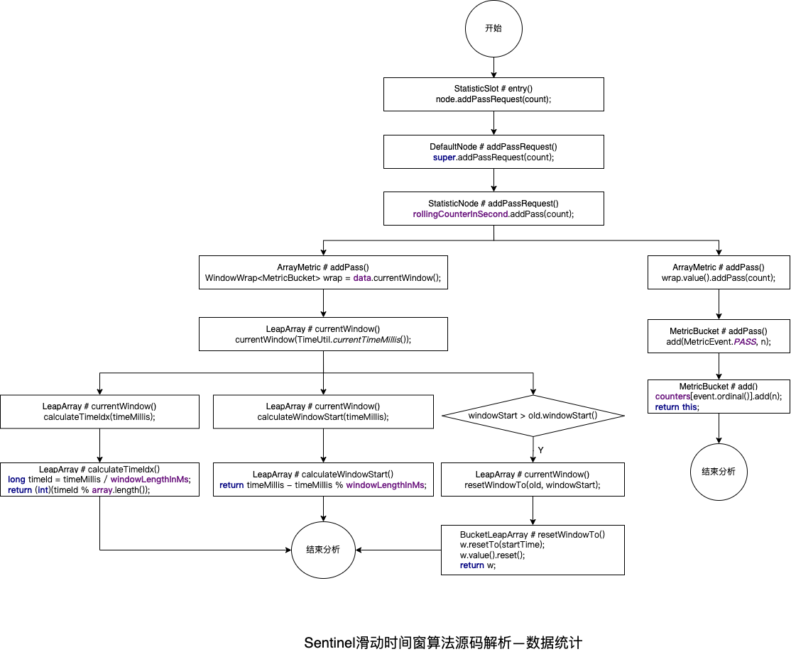

# Sentinel: 分布式系统的流量防卫兵

[官方文档](https://github.com/alibaba/Sentinel/wiki/%E4%BB%8B%E7%BB%8D)

[Awesome Sentinel](./awesome-sentinel.md)

## Sentinel 是什么？

Sentinel 是分布式系统的防御系统。以流量为切入点，通过动态设置的流量控制、服务熔断降级、系统负载保护等多个维度保护服务的稳定性，通过服务降级增强服务被拒后用户的体验。


### Sentinel 具有以下特征:

- **丰富的应用场景**：Sentinel 承接了阿里巴巴近 10 年的双十一大促流量的核心场景，例如秒杀（即突发流量控制在系统容量可以承受的范围）、消息削峰填谷、集群流量控制、实时熔断下游不可用应用等。
- **完备的实时监控**：Sentinel 同时提供实时的监控功能。您可以在控制台中看到接入应用的单台机器秒级数据，甚至 500 台以下规模的集群的汇总运行情况。
- **广泛的开源生态**：Sentinel 提供开箱即用的与其它开源框架/库的整合模块，例如与 Spring Cloud、Apache Dubbo、gRPC、Quarkus 的整合。您只需要引入相应的依赖并进行简单的配置即可快速地接入 Sentinel。同时 Sentinel 提供 Java/Go/C++ 等多语言的原生实现。
- **完善的 SPI 扩展机制**：Sentinel 提供简单易用、完善的 SPI 扩展接口。您可以通过实现扩展接口来快速地定制逻辑。例如定制规则管理、适配动态数据源等。


### Sentinel 的主要特性：


### Sentinel 分为两个部分:

- 核心库（Java 客户端）不依赖任何框架/库，能够运行于所有 Java 运行时环境，同时对 Dubbo / Spring Cloud 等框架也有较好的支持。
- 控制台（Dashboard）基于 Spring Boot 开发，打包后可以直接运行，不需要额外的 Tomcat 等应用容器。


## Sentinel 基本概念

### 资源

- 资源是 Sentinel 的关键概念。它可以是 Java 应用程序中的任何内容，例如，由应用程序提供的服务，或由应用程序调用的其它应用提供的服务，甚至可以是一段代码。在接下来的文档中，我们都会用资源来描述代码块。

- 只要通过 Sentinel API 定义的代码，就是资源，能够被 Sentinel 保护起来。大部分情况下，可以使用方法签名，URL，甚至服务名称作为资源名来标示资源。


### 规则

围绕资源的实时状态设定的规则，可以包括流量控制规则、熔断降级规则以及系统保护规则。所有规则可以动态实时调整。


## Sentinel 工作原理

### 架构图解析

#### Sentinel 的架构图


Sentinel 的核心骨架是 ProcessorSlotChain。其将不同的 Slot 按照顺序串在一起（责任链模式），从而将不同的功能组合在一起（限流、降级、系统保护）。系统会为每个资源创建一套 SlotChain。


### SPI 机制

Sentinel 槽链中各 Slot 的执行顺序是固定好的。但并不是绝对不能改变的。Sentinel 将 ProcessorSlot 作为 SPI 接口进行扩展，使得 SlotChain 具备了扩展能力。用户可以自定义 Slot并编排 Slot 间的顺序，从而可以给 Sentinel 添加自定义的功能。


### Slot 简介

#### NodeSelectorSlot

负责收集资源的路径，并将这些资源的调用路径，以树状结构存储起来，用于根据调用路径来限流降。

```java
ContextUtil.enter("entrance1", "appA");
 Entry nodeA = SphU.entry("nodeA");
 if (nodeA != null) {
    nodeA.exit();
 }
 ContextUtil.exit();
```

上述代码通过 `ContextUtil.enter()` 创建了一个名为 `entrance1` 的上下文，同时指定调用发起者为 `appA`；接着通过 `SphU.entry()`请求一个 token，如果该方法顺利执行没有抛 `BlockException`，表明 token 请求成功。

以上代码将在内存中生成以下结构：

```txt
 	     	machine-root
                 /     
                /
         EntranceNode1
              /
             /   
      DefaultNode(nodeA)
```

注意：每个 `DefaultNode` 由资源 ID 和输入名称来标识。换句话说，一个资源 ID 可以有多个不同入口的 DefaultNode。

```java
ContextUtil.enter("entrance1", "appA");
  Entry nodeA = SphU.entry("nodeA");
  if (nodeA != null) {
    nodeA.exit();
  }
  ContextUtil.exit();

  ContextUtil.enter("entrance2", "appA");
  nodeA = SphU.entry("nodeA");
  if (nodeA != null) {
    nodeA.exit();
  }
  ContextUtil.exit();
```

以上代码将在内存中生成以下结构：

```txt
                   machine-root
                   /         \
                  /           \
          EntranceNode1   EntranceNode2
                /               \
               /                 \
       DefaultNode(nodeA)   DefaultNode(nodeA)
```

上面的结构可以通过调用 `curl http://localhost:8719/tree?type=root` 来显示：

```txt
EntranceNode: machine-root(t:0 pq:1 bq:0 tq:1 rt:0 prq:1 1mp:0 1mb:0 1mt:0)
-EntranceNode1: Entrance1(t:0 pq:1 bq:0 tq:1 rt:0 prq:1 1mp:0 1mb:0 1mt:0)
--nodeA(t:0 pq:1 bq:0 tq:1 rt:0 prq:1 1mp:0 1mb:0 1mt:0)
-EntranceNode2: Entrance1(t:0 pq:1 bq:0 tq:1 rt:0 prq:1 1mp:0 1mb:0 1mt:0)
--nodeA(t:0 pq:1 bq:0 tq:1 rt:0 prq:1 1mp:0 1mb:0 1mt:0)

t:threadNum  pq:passQps  bq:blockedQps  tq:totalQps  rt:averageRt  prq: passRequestQps 1mp:1m-passed 1mb:1m-blocked 1mt:1m-total
```


#### ClusterBuilderSlot

用于存储资源的统计信息以及调用者信息，例如该资源的 RT，QPS，thread count，Block count，Exception count 等等，这些信息将用作为多维度限流，降级的依据。简单来说，就是用于构建 ClusterNode。


#### StatisticSlot

用于记录、统计不同纬度的 runtime 指标监控信息。

`StatisticSlot` 是 Sentinel 的核心功能插槽之一，用于统计实时的调用数据。

- `clusterNode`：资源唯一标识的 ClusterNode 的实时统计
- `origin`：根据来自不同调用者的统计信息
- `defaultnode`: 根据入口上下文区分的资源 ID 的 runtime 统计
- 入口流量的统计

Sentinel 底层采用高性能的滑动窗口数据结构 `LeapArray` 来统计实时的秒级指标数据，可以很好地支撑写多于读的高并发场景。


#### ParamFlowSlot

对应**热点流控**。


#### FlowSlot

用于根据预设的限流规则以及前面 slot 统计的状态，来进行流量控制。对应**流控规则**。

这个 slot 主要根据预设的资源的统计信息，按照固定的次序，依次生效。如果一个资源对应两条或者多条流控规则，则会根据如下次序依次检验，直到全部通过或者有一个规则生效为止:

- 指定应用生效的规则，即针对调用方限流的；
- 调用方为 other 的规则；
- 调用方为 default 的规则。


#### AuthoritySlot

根据配置的黑白名单和调用来源信息，来做黑白名单控制。对应**授权规则** 。


#### DegradeSlot

主要针对资源的平均响应时间（RT）以及异常比率，来决定资源是否在接下来的时间被自动熔断掉，即通过统计信息以及预设的规则，来做熔断降级。对应**降级规则**。


#### SystemSlot

通过系统的状态，例如 load1 等，来控制总的入口流量。对应**系统规则**。

这个 slot 会根据对于当前系统的整体情况，对入口资源的调用进行动态调配。其原理是让入口的流量和当前系统的预计容量达到一个动态平衡。

注意系统规则只对入口流量起作用（调用类型为 `EntryType.IN`），对出口流量无效。可通过 `SphU.entry(res, entryType)` 指定调用类型，如果不指定，默认是 `EntryType.OUT`。


### Sentinel 核心类解析

### ProcessorSlotChain

Sentinel 的核心骨架，将不同的 Slot 按照顺序串在一起（责任链模式），从而将不同的功能（限流、降级、系统保护）组合在一起。slot chain 其实可以分为两部分：统计数据构建部分（statistic）和判断部分（rule checking）。核心结构：


目前的设计是 one slot chain per resource，因为某些 slot 是 per resource 的（比如 NodeSelectorSlot）。


#### Context 简介

- Context 代表调用链路上下文，贯穿一次调用链路中的所有 `Entry`。Context 维持着入口节点（`entranceNode`）、本次调用链路的 curNode、调用来源（`origin`）等信息。Context 名称即为调用链路入口名称。

- Context 维持的方式：通过 ThreadLocal 传递，只有在入口 `enter` 的时候生效。由于 Context 是通过 ThreadLocal 传递的，因此对于异步调用链路，线程切换的时候会丢掉 Context，因此需要手动通过 `ContextUtil.runOnContext(context, f)` 来变换 context。

- Context 是对资源操作的上下文，每个资源操作必须属于一个 Context。如果代码中没有指定 Context， 则会创建一个 name 为 sentinel_default_context 的默认 Context。一个Context 生命周期中可以包含多个资源操作。Context 生命周期中的最后一个资源在 exit() 时会清理该 Conetxt，这也就意味着这个 Context 的生命周期结束了。


#### Context 代码举例

```java
public void contextDemo() {
    // 创建一个来自于 appA 访问的 Context，
    // entranceOne 为 Context 的 name
    ContextUtil.enter("entranceOne", "appA");
    // Entry 就是一个资源操作对象
    Entry resource1 = null;
    Entry resource2 = null;
    try {
        // 获取资源 resource1 的 entry
        resource1 = SphU.entry("resource1");
        // 代码能走到这里，说明当前对资源 resource1 的请求通过了流控
        // 对资源 resource1 的相关业务处理。。。

        // 获取资源 resource2 的 entry
        resource2 = SphU.entry("resource2");
        // 代码能走到这里，说明当前对资源 resource2 的请求通过了流控
        // 对资源 resource2 的相关业务处理。。。
    } catch (BlockException e) {
        // 代码能走到这里，说明请求被限流，
        // 这里执行降级处理
    } finally {
        if (resource1 != null) {
            resource1.exit();
        }
        if (resource2 != null) {
            resource2.exit();
        }
    }
    // 释放 Context
    ContextUtil.exit();

    // --------------------------------------------------------

    // 创建另一个来自于 appA 访问的 Context，
    // entranceTwo 为 Context 的 name
    ContextUtil.enter("entranceTwo", "appA");
    // Entry 就是一个资源操作对象
    Entry resource3 = null;
    try {
        // 获取资源 resource2 的 entry
        resource2 = SphU.entry("resource2");
        // 代码能走到这里，说明当前对资源 resource2 的请求通过了流控
        // 对资源 resource2 的相关业务处理。。。


        // 获取资源 resource3 的 entry
        resource3 = SphU.entry("resource3");
        // 代码能走到这里，说明当前对资源 resource3 的请求通过了流控
        // 对资源 resource3 的相关业务处理。。。

    } catch (BlockException e) {
        // 代码能走到这里，说明请求被限流，
        // 这里执行降级处理
    } finally {
        if (resource2 != null) {
            resource2.exit();
        }
        if (resource3 != null) {
            resource3.exit();
        }
    }
    // 释放 Context
    ContextUtil.exit();
}
```


#### Entry

- 每一次资源调用都会创建一个 `Entry`。`Entry` 包含了资源名、curNode（当前统计节点）、originNode（来源统计节点）等信息。

- `CtEntry` 为普通的 `Entry`，在调用 `SphU.entry(xxx)` 的时候创建。特性：Linked entry within current context（内部维护着 `parent` 和 `child`）

- **需要注意的一点**：CtEntry 构造函数中会做**调用链的变换**，即将当前 Entry 接到传入 Context 的调用链路上（`setUpEntryFor`）。

- 资源调用结束时需要 `entry.exit()`。exit 操作会过一遍 slot chain exit，恢复调用栈，exit context 然后清空 entry 中的 context 防止重复调用。


### Node

Sentinel 里面的各种种类的统计节点：

- `StatisticNode`：最为基础的统计节点，包含秒级和分钟级两个滑动窗口结构。
- `DefaultNode`：链路节点，用于统计调用链路上某个资源的数据，维持树状结构。
- `ClusterNode`：簇点，用于统计每个资源全局的数据（不区分调用链路），以及存放该资源的按来源区分的调用数据（类型为 `StatisticNode`）。特别地，`Constants.ENTRY_NODE` 节点用于统计全局的入口资源数据。
- `EntranceNode`：入口节点，特殊的链路节点，对应某个 Context 入口的所有调用数据。`Constants.ROOT` 节点也是入口节点。

构建的时机：

- `EntranceNode` 在 `ContextUtil.enter(xxx)` 的时候就创建了，然后塞到 Context 里面。
- `NodeSelectorSlot`：根据 context 创建 `DefaultNode`，然后 set curNode to context。
- `ClusterBuilderSlot`：首先根据 resourceName 创建 `ClusterNode`，并且 set clusterNode to defaultNode；然后再根据 origin 创建来源节点（类型为 `StatisticNode`），并且 set originNode to curEntry。

几种 Node 的维度（数目）：

- `ClusterNode` 的维度是 resource
- `DefaultNode` 的维度是 resource * context，存在每个 NodeSelectorSlot 的 `map` 里面
- `EntranceNode` 的维度是 context，存在 ContextUtil 类的 `contextNameNodeMap` 里面
- 来源节点（类型为 `StatisticNode`）的维度是 resource * origin，存在每个 ClusterNode 的 `originCountMap` 里面


#### StatisticSlot

`StatisticSlot` 是 Sentinel 最为重要的类之一，用于根据规则判断结果进行相应的统计操作。

entry 的时候：依次执行后面的判断 slot。每个 slot 触发流控的话会抛出异常（`BlockException` 的子类）。若有 `BlockException` 抛出，则记录 block 数据；若无异常抛出则算作可通过（pass），记录 pass 数据。

exit 的时候：若无 error（无论是业务异常还是流控异常），记录 complete（success）以及 RT，线程数-1。

记录数据的维度：线程数+1、记录当前 DefaultNode 数据、记录对应的 originNode 数据（若存在 origin）、累计 IN 统计数据（若流量类型为 IN）。


#### Node间的关系


- Node：用于完成数据统计的接口；
- StatisticNode：统计节点，是 Node 接口的实现类，用于完成数据统计；
- EntranceNode：入口节点，一个 Context 会有一个入口节点，用于统计当前 Context 的总体流量数据；
- DefaultNode：默认节点，用于统计一个资源在当前 Context 中的流量数据；
- ClusterNode：集群节点，用于统计一个资源在所有 Context 中的总体流量数据；


## Sentinel 核心源码解析


## 滑动时间窗算法

对于滑动时间窗算法的源码解析分为两部分：对数据的统计，与对统计数据的使用。

### 时间窗限流算法

#### 算法原理


- 该算法原理是，系统会自动选定一个时间窗口的起始零点，然后按照固定长度将时间轴划分为若干定长 的时间窗口。所以该算法也称为“固定时间窗算法”。

- 当请求到达时，系统会查看该请求到达的时间点所在的时间窗口当前统计的数据是否超出了预先设定好 的阈值。未超出，则请求通过，否则被限流。


#### 存在的问题


该算法存在这样的问题：连续两个时间窗口中的统计数据都没有超出阈值，但在跨窗口的时间窗长度范 围内的统计数据却超出了阈值。


### 滑动时间窗限流算法

#### 算法原理


滑动时间窗限流算法解决了固定时间窗限流算法的问题。其没有划分固定的时间窗起点与终点，而是将 每一次请求的到来时间点作为统计时间窗的终点，起点则是终点向前推时间窗长度的时间点。这种时间 窗称为“滑动时间窗”。


#### 存在的问题


#### 算法改进


- 针对以上问题，系统采用了一种“折中”的改进措施：将整个时间轴拆分为若干“样本窗口”，样本窗口的 长度是小于滑动时间窗口长度的。当等于滑动时间窗口长度时，就变为了“固定时间窗口算法”。 一般 时间窗口长度会是样本窗口长度的整数倍。

- 那么是如何判断一个请求是否能够通过呢？当到达样本窗口终点时间时，每个样本窗口会统计一次本样 本窗口中的流量数据并记录下来。当一个请求到达时，会统计出当前请求时间点所在样本窗口中的流量 数据，然后再获取到当前请求时间点所在时间窗中其它样本窗口的统计数据，求和后，如果没有超出阈 值，则通过，否则被限流。


### 数据统计源码解析




### 使用统计数据


